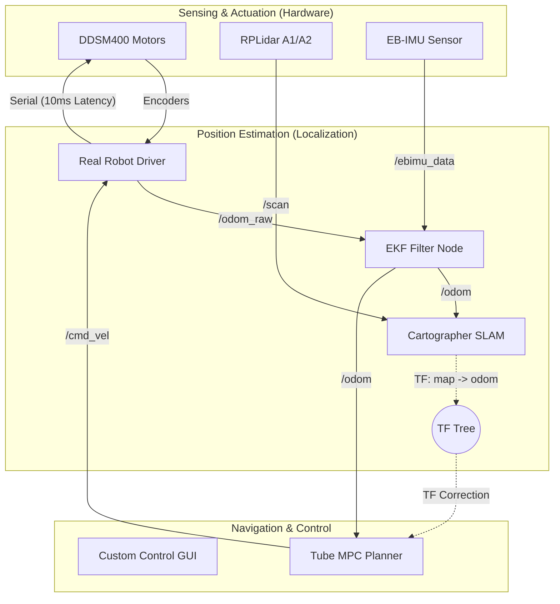

# 🤖 Relay Robot Proto-Type: ROS 2 Humble 기반 모바일 로봇 시스템

본 프로젝트는 병원 및 실내 서비스 환경을 타겟으로 하는 **Differential Drive 모바일 로봇**의 시제품 개발을 위한 ROS 2 Humble 기반 통합 워크스페이스입니다. 단순한 기능 구현을 넘어, 센서 데이터의 신뢰성을 확보하고 복잡한 TF 구조를 체계적으로 관리하는 데 초점을 맞추었습니다.

---

## 🏗️ 시스템 아키텍처 (System Architecture)

전체 시스템은 **입력-처리-출력**의 선순환 구조로 설계되었습니다. 특히, 로봇의 위치 추정(Localization) 성능을 극대화하기 위해 센서 융합 레이어를 별도로 분리하였습니다.

### 🔄 데이터 흐름도 (Data Flow)



### 🧐 왜 odom_raw와 odom을 분리했나요?
실제 로봇 주행 시 바퀴의 미끄러짐(Slip)이나 인코더 오차는 피할 수 없습니다. 
- **`odom_raw`**: 드라이버 노드에서 발행하는 순수 휠 인코더 기반 오도메트리입니다.
- **`odom` (Filtered)**: `odom_raw`와 고정밀 IMU 데이터를 EKF(Extended Kalman Filter)로 융합한 결과입니다. SLAM의 `map->odom` TF 보정치가 실시간으로 반영되어 지도상에서 매우 정확하고 부드러운 위치 정보를 제공합니다.

---

## 📁 워크스페이스 구조 (Workspace Structure)

처음 워크스페이스를 내려받으셨나요? 각 패키지의 역할을 통해 시스템을 빠르게 파악할 수 있습니다.

| 패키지명 | 역할 | 핵심 내용 |
| :--- | :--- | :--- |
| **`relayrobot_driver`** | **핵심 구동부** | 모터 드라이버와의 시리얼 통신, `/odom_raw` 발행 |
| **`mpc_tubempc_bridge`** | **핵심 제어부** | Tube MPC를 이용한 정밀 궤적 추종 및 로봇 제어 |
| **`relayrobot_description`** | 로봇 정의 및 설정 | URDF(모델), 센서 위치, 전체 시스템 Launch 파일 |
| **`ebimu_pkg`** | IMU 센서 드라이버 | EB-IMU 데이터를 `/ebimu_data` 토픽으로 변환 |
| **`sllidar_ros2`** | 라이다 드라이버 | RPLidar A1/A2 스캔 데이터를 `/scan`으로 발행 |
| **`gui_py`** | 통합 제어 GUI | SLAM 실행, 수동 조종, MPC 제어 인터페이스 제공 |

---

## 🛠️ 하드웨어 설치 및 셋업 팁 (Hardware Setup)

정밀한 자율주행을 위해서는 소프트웨어만큼 하드웨어의 물리적 배치가 중요합니다.

### 1. IMU(EB-IMU) 설치 가이드
*   **최적 위치:** 로봇의 **회전 중심(Center of Rotation)**, 즉 두 바퀴 축의 정중앙에 설치하는 것이 가장 좋습니다. 중심에서 멀어질수록 회전 시 가속도 오차가 발생합니다.
*   **표준 방향 (REP-103 준수):** ROS 2 표준에 따라 IMU의 방향을 로봇 본체와 일치시켜야 합니다.
    *   **X축 (Forward):** 로봇의 **정면(전진 방향)**
    *   **Y축 (Left):** 로봇의 **왼쪽**
    *   **Z축 (Up):** 하늘 방향
    *   *Tip:* IMU 센서 표면의 화살표가 로봇의 전진 방향(X)과 일치하는지 반드시 확인하십시오.
*   **수평 유지:** 지면과 완벽하게 수평이 되도록 고정하십시오. 기울어질 경우 회전 데이터에 중력 가속도가 섞여 오차가 발생합니다.
*   **진동 절연:** 모터의 미세 진동이 센서에 전달되지 않도록 얇은 고무 패드나 폼 테이프 위에 부착하는 것을 권장합니다.

### 2. DDSM HAT(B) 모터 드라이버 연결 주의사항 ⚠️

#### 반드시 ESP32 모드로 연결할 것
DDSM HAT(B)는 두 가지 모드(Arduino / ESP32)를 지원합니다.  
**이 프로젝트는 반드시 ESP32 모드로 설정해야 합니다.**
- ESP32 모드 설정 시 → `/dev/ttyACM0` 으로 인식
- 모드가 다르면 포트가 잡혀도 JSON 명령이 무시됨

#### cmd 값 스케일링 (중요!)
DDSM HAT(B) ESP32 모드는 cmd 값을 그대로 RPM으로 해석하지 않습니다.

| cmd 값 | 실제 RPM |
| :--- | :--- |
| 100 | 10 RPM |
| 10 | 1 RPM |
| 600 | 60 RPM |

> **공식:** `실제 RPM = cmd ÷ 10`  
> `motor_node_1.py` 내 변환식에서 `/ 600.0` 을 쓰는 이유가 바로 이 때문입니다. (일반 RPM 변환 `/ 60.0` × 보정 `/ 10`)

#### 시리얼 권한 (최초 1회 설정, 이후 sudo 불필요)
```bash
sudo usermod -aG dialout $USER
# 반드시 로그아웃 후 재로그인 해야 적용됨
```
적용 확인:
```bash
groups | grep dialout   # dialout 이 출력되면 성공
```

#### 단독 통신 테스트
ROS 없이 모터 단독 통신 확인:
```bash
python3 src/relayrobot_driver/relayrobot_driver/motor_test_1.py
```

### 3. 모터 제어 지연 최적화
본 프로젝트는 제어 응답성을 위해 모터 명령 사이의 지연 시간을 **10ms**로 최적화하였습니다. (`motor_drive_1.py` 수정 완료)

---

## 📍 TF 좌표계의 이해 (Coordinate Systems)

모바일 로봇 공학에서 TF(Transform)는 로봇의 "언어"입니다. 본 프로젝트는 ROS 표준 규격(REP-105)을 엄격히 준수합니다.

| 좌표계 | 의미 | 책임 노드 | 특징 |
| :--- | :--- | :--- | :--- |
| **`base_link`** | 로봇의 물리적 중심 | `robot_state_publisher` | 모든 센서(Lidar, IMU)의 기준점 |
| **`odom`** | 로봇이 출발한 이후의 상대적 위치 | `ekf_filter_node` | 연속적이지만 누적 오차가 존재함 |
| **`map`** | 우리가 살아가는 실제 세계(지도) | `cartographer` | **Ground Truth.** SLAM이 오차를 계산하여 `map->odom` TF로 보정 |

> **"SLAM은 왜 위치를 보정하나요?"**  
> 로봇이 10m를 갔다고 생각해도 바퀴가 헛돌면 실제로는 9m만 갔을 수 있습니다. SLAM은 라이다로 벽의 모양을 관찰하며 "어? 너 9m 지점에 있네!"라고 말해주며 `map`과 `odom` 사이의 간격을 비틀어(Correction) 로봇의 위치를 바로잡습니다.

### 🧐 제어기는 왜 `/odom`을 구독하는데 SLAM 보정이 되나요? (TF의 원리)

가장 많이 하는 질문 중 하나가 **"제어기(MPC)가 `/odom` 토픽을 받으면, SLAM이 계산한 지도상의 정확한 위치는 무시되는 것 아닌가요?"**입니다. 결론부터 말씀드리면, **그렇지 않습니다.**

ROS 2의 좌표계는 **TF(Transform) Tree**라는 사슬로 연결되어 있습니다.

1.  **EKF (Odometry):** "나는 출발점으로부터 10m 왔어!" (`odom -> base_link`)
2.  **SLAM (Map):** 라이다 스캔을 보니 오도메트리가 5cm 틀렸네? "내가 `map`과 `odom` 사이를 5cm 벌려줄게!" (`map -> odom`)
3.  **최종 계산:** 시스템은 `map -> odom`과 `odom -> base_link`를 곱해서 **"지도 기준 로봇의 위치"**를 실시간으로 합산합니다.

**결론:** 제어기가 부드러운 주행을 위해 `/odom` 토픽의 흐름을 따라가더라도, 전역 플래너가 **SLAM이 실시간으로 보정하고 있는 `map -> odom` TF 변환값**을 경로 계산에 반영하기 때문에 결국 로봇은 지도의 목표점에 정확히 도착하게 됩니다.

---

## 🛠️ 핵심 문제 해결 및 디버깅 로그

단순히 코드를 짜는 것보다 중요한 것은 **"어디가 문제인지 찾아내고 해결하는 과정"**이었습니다.

### 1. 좌표계 떨림 현상 (Double TF Conflict)
- **문제 원인**: 모터 드라이버와 EKF 노드가 동시에 `odom -> base_link` TF를 발행함.
- **증상**: RViz에서 로봇 모델이 미친 듯이 떨리고 SLAM이 경로를 잃어버림.
- **해결**: 드라이버 내 TF 브로드캐스터를 비활성화하고, 오직 **EKF 노드만** TF를 발행하도록 단일화.
- **결과**: 깨끗하고 안정적인 TF 트리 구성 완료.

### 2. 프로세스 좀비(Zombie) 현상
- **문제 원인**: Python으로 작성된 GUI에서 SLAM이나 센서 노드 종료 시, 백그라운드 프로세스가 살아있어 시리얼 포트를 점유함.
- **증상**: 노드 재실행 시 "Port already in use" 에러 발생.
- **해결**: `os.setsid()`로 세션을 분리하고 `os.killpg()`를 호출해 프로세스 그룹 전체를 확실히 종료.
- **결과**: 리소스 누수 없는 안정적인 GUI 컨트롤러 구현.

### 3. MPC "장님" 주행 (MPC Blind Control)
- **문제 원인**: 제어기가 목표치만 던지고 로봇의 현재 위치 피드백을 받지 않음.
- **증상**: 로봇이 목표 방향과 상관없이 제멋대로 주행함.
- **해결**: MPC 로직에 `/odom` 구독을 추가하여 실시간 오차(Distance/Angle Error)를 계산하는 피드백 루프 완성.
- **결과**: 정교한 궤적 추종 주행 가능.

### 4. EB-IMU 시리얼 파싱 오류 수정 및 캘리브레이션 추가 (2026-06-14)
- **문제 원인**: `readline()`이 `\r\n` 두 줄 동시에 읽어 데이터가 `0.003.001` 처럼 붙어서 파싱 실패.
- **해결**:
  - `.replace('\r','').replace('\n','')` 로 개행문자 완전 제거
  - `*` 시작 확인 + 정확히 9개 필드 검증 후 파싱
- **YAW wraparound 수정**: EBIMU가 0~360° 출력 → 왼쪽 회전 시 335° 등으로 튐 → `-180~+180°` 로 변환
  ```python
  yaw_deg = data[2] - 360 if data[2] > 180 else data[2]
  ```
- **초기 바이어스 캘리브레이션 추가**: 노드 시작 후 10초간 정지 상태 평균값을 구해 ACC(x,y), GYRO(z) 바이어스 자동 제거
- **EKF에 넘기는 필드**:
  - `orientation` (YAW → Quaternion 변환) — 절대 헤딩
  - `angular_velocity.z` (GYROZ) — 회전 속도 ← **EKF에서 가장 중요**
  - `linear_acceleration.x/y` (ACCX, ACCY) — 선가속도
  - ROLL/PITCH, ACCZ, GYROX/Y 는 지상 로봇에서 불필요
- **테스트 스크립트** (`ebimu_pkg` 패키지):

  ```bash
  # ROS 없이 raw 값 확인
  python3 src/ebimu_pkg/ebimu_pkg/imu_test_1.py

  # 캘리브레이션 + EKF 필요 필드만 출력
  python3 src/ebimu_pkg/ebimu_pkg/imu_test_2.py

  # ros publiasher
  ros2 run ebimu_pkg ebimu_publisher --ros-args -p port:=/dev/ttyUSB0
  
  # ros subscriber
  ros2 topic echo /ebimu_data

  ```

### 5. DDSM HAT(B) ESP32 모드 모터 첫 통신 확인 (2026-06-14)
- **상황**: Lidar, DDSM HAT(B), IMU를 처음 동시 연결 후 모터가 동작하지 않음.
- **원인**: 명령어 오류 + 연결 방식 미확인 (ESP32 모드 미설정).
- **확인 사항**:
  - DDSM driver HAT(B)를 **ESP32 모드**로 설정 → `/dev/ttyACM0` 으로 인식됨.
  - `cmd 100 = 10 RPM` 스케일링 주의 (cmd 값은 RPM의 10배로 전달).
  - 포트 첫 접근 시 `Permission denied` 에러 → `sudo usermod -aG dialout $USER` 후 재로그인으로 해결.
- **결과**: `motor_test_1.py`(`relayrobot_driver` 패키지 내)로 단독 통신 확인 완료.
  ```bash
  # ROS 없이 단독 모터 테스트
  python3 src/relayrobot_driver/relayrobot_driver/motor_test_1.py
  ```

---

## 🌐 원격 통신 및 네트워크 설정 (Remote Communication)

본 프로젝트는 실제 로봇(Robot PC)에서 센서를 구동하고, 성능이 좋은 작업용 컴퓨터(Remote PC)에서 시각화 및 복잡한 연산을 수행하는 **원격 제어 환경**에 최적화되어 있습니다.

### 1. IP 주소 확인 (IP Address)
두 컴퓨터가 동일한 네트워크(Wi-Fi 또는 LAN)에 연결되어 있는지 확인한 후, 각 터미널에서 아래 명령어로 IP를 확인합니다.
```bash
hostname -I
```
> **Tip:** 보통 `192.168.x.x` 형태로 출력되는 주소가 해당 기기의 내부 IP입니다.

### 2. ROS 2 통신 설정 (ROS_DOMAIN_ID)
여러 대의 로봇이 같은 네트워크를 쓸 때 데이터 혼선을 막기 위해 고유한 ID를 부여합니다. **Robot PC와 Remote PC는 반드시 같은 ID를 가져야 합니다.**
```bash
# ~/.bashrc 파일 하단에 추가하는 것을 권장합니다.
export ROS_DOMAIN_ID=30  # 0~232 사이의 임의의 숫자
```

### 3. 연결 테스트
- **Network:** Remote PC에서 `ping [Robot_IP]`를 입력해 응답이 오는지 확인합니다.
- **ROS 2:** Robot PC에서 노드를 실행한 상태에서 Remote PC 터미널에 `ros2 topic list`를 입력했을 때 토픽이 보이면 통신 성공입니다.

---

## 🚀 실행 가이드 (How to Run)

### 0. 환경 설정 — 터미널 열 때마다 자동 소싱 (최초 1회 설정)

ROS 2 명령어를 쓰려면 터미널을 열 때마다 아래 두 줄을 실행해야 합니다.  
매번 치는 게 번거로우니 `~/.bashrc`에 alias를 등록해두면 명령어 하나로 해결됩니다.

```bash
# ~/.bashrc 하단에 아래 내용 추가
echo '' >> ~/.bashrc
echo '# ROS 2 환경 소싱 alias' >> ~/.bashrc
echo 'alias ros_setup="source /opt/ros/humble/setup.bash && source ~/mobile_robot_proto_type/install/setup.bash && echo ROS2 환경 로드 완료"' >> ~/.bashrc
source ~/.bashrc
```

이후 새 터미널을 열 때마다 아래 한 줄만 입력하면 됩니다:

```bash
ros_setup
```

> **Tip:** 매 터미널마다 자동으로 소싱되길 원하면 alias 대신 두 줄을 직접 `~/.bashrc`에 추가하세요.
> ```bash
> echo 'source /opt/ros/humble/setup.bash' >> ~/.bashrc
> echo 'source ~/mobile_robot_proto_type/install/setup.bash' >> ~/.bashrc
> source ~/.bashrc
> ```
> 단, 이 경우 ROS 2가 설치되지 않은 환경에서 터미널을 열면 에러가 출력될 수 있습니다.

---

### 1. 실제 로봇 기동 (Hardware Launch)
모든 하드웨어(모터, 라이다, IMU)와 EKF 필터를 한 번에 실행합니다.
```bash
ros2 launch relayrobot_description real_robot_260519.launch.py
```
- **내부 동작**: 센서 드라이버 구동 → `robot_description` 로드 → EKF 필터가 `odom -> base_link` 발행 시작.

### 2. GUI 제어기 및 SLAM 실행
```bash
ros2 run gui_py gui_py
```
- 화면의 **[Start SLAM]** 버튼을 누르면 내부적으로 `Cartographer`가 실행되며 지도를 그리기 시작합니다.

### 3. 시각화 (RViz2)
```bash
rviz2
```
- **필수 설정**: `Global Options -> Fixed Frame`을 반드시 **`map`**으로 설정해야 보정된 위치를 볼 수 있습니다.

---

### 시나리오 B: 완성된 지도 기반 자율 주행 (원격 제어 및 제어기 검증)

현재 GUI가 프로토타입 형태이더라도, 실제 현장에서는 자원을 효율적으로 쓰기 위해 **로봇 본체(Robot PC)**와 **원격 관제 컴퓨터(Remote PC)**를 분리하여 운영하는 것이 정석입니다. 아래는 원격지에서 지도를 저장하고, 로봇의 위치를 인식시킨 뒤, 제안하신 **사용자 정의 제어기(Tube MPC)**가 정상 작동하는지 검증하는 표준 매뉴얼입니다.

#### 1단계: 하드웨어 기동 (통신 분리)
*   **[Robot PC]** 로봇 본체에서는 센서와 모터, EKF 필터 등 가벼운 필수 노드만 실행합니다.
    ```bash
    ros2 launch relayrobot_description real_robot_260519.launch.py
    ```
*   *(이후 2~5단계의 모든 명령어는 동일한 네트워크(ROS_DOMAIN_ID)로 연결된 **Remote PC**에서 실행합니다.)*

#### 2단계: SLAM 맵 저장 (Map Saving)
시나리오 A를 통해 지도를 모두 그렸다면, 자율주행을 위해 지도를 파일로 저장해야 합니다.
```bash
# [Remote PC] 터미널을 열고 지도 저장 명령 실행
ros2 run nav2_map_server map_saver_cli -f ~/my_robot_map
```
*   **결과:** 지정한 경로에 `my_robot_map.pgm` (이미지)과 `my_robot_map.yaml` (메타데이터) 파일이 생성됩니다.

#### 3단계: 맵 로드 및 로봇 초기 위치 인식 (Localization)
저장된 지도를 불러오고 제어기에게 "로봇이 현재 지도상 어디에 있는지(초기 위치)"를 알려주는 매우 중요한 단계입니다. 현재 위치를 모르면 제어기는 궤적을 짤 수 없습니다.
```bash
# [Remote PC] 지도를 불러오고 위치 추정 노드 실행
# (Cartographer localization 모드 또는 AMCL 사용)
ros2 launch relayrobot_description localization.launch.py map:=~/my_robot_map.yaml
```
*   **RViz 설정:** RViz를 켜고 툴바의 **[2D Pose Estimate]** 버튼을 클릭해 실제 로봇이 서 있는 위치와 바라보는 방향을 지도상에 찍어줍니다. 
*   **목적:** 이 작업을 통해 비로소 `map -> odom` TF가 연결되며, 로봇이 글로벌 좌표계에서 자신의 위치를 깨닫게 됩니다.

#### 4단계: 제안 제어기(Tube MPC) 구동 및 명령 전달
위치 인식이 완료되었다면, 제안하신 자율주행 제어기를 실행하여 목적지까지의 경로를 추종하게 합니다.
```bash
# [Remote 정밀 제어] GUI 또는 백그라운드에서 직접 구현한 MPC 제어기 노드 실행
ros2 run mpc_tubempc_bridge mpc_node
```
*   **제어 지령 전달:** RViz 툴바의 **[2D Nav Goal]** 버튼을 사용해 목표 지점을 찍어주거나, 별도의 Goal 토픽을 발행하여 제어기에게 목적지를 전달합니다.

#### 5단계: 제어 성능 검증 및 모니터링 (디버깅)
자율주행 시 로봇이 움직이는 것만 보고 "성공했다"고 판단하면 안 됩니다. 다음 세 가지를 반드시 검증해야 합니다.

1.  **제어기 출력 상태 확인 (`/cmd_vel`)**
    *   터미널에서 `ros2 topic echo /cmd_vel`을 입력합니다.
    *   MPC 제어기가 산출한 선속도(X)와 각속도(Yaw) 값이 비정상적으로 튀지 않고 부드럽게 출력되는지 확인합니다.
2.  **Tracking Error(추종 오차) 확인 (`/odom` vs Target)**
    *   로봇의 실제 궤적(`/odom`)이 제어기가 의도한 수학적 경로(Path)와 일치하는지, 오차가 수렴하는지 확인합니다.
3.  **TF 및 시각적 안정성 (RViz)**
    *   로봇이 주행할 때 RViz 상의 로봇 모델(`base_link`)이 덜덜 떨리거나 순간 이동을 한다면, 제어기 문제가 아니라 "TF 충돌"이나 "네트워크 지연" 문제입니다. 로봇이 부드럽게 주행하는지 시각적으로 확인하세요.

---

## 📊 ROS 2 주요 토픽 구조

| 토픽명 | 타입 | 설명 |
| :--- | :--- | :--- |
| `/odom_raw` | `nav_msgs/Odometry` | 필터링되지 않은 원시 휠 인코더 데이터 |
| `/odom` | `nav_msgs/Odometry` | **EKF로 융합된 고정밀 위치 정보** |
| `/scan` | `sensor_msgs/LaserScan` | RPLidar로부터 들어오는 거리 데이터 |
| `/cmd_vel` | `geometry_msgs/Twist` | 로봇에 내리는 속도 명령 (GUI/MPC 출력) |

---

## 📋 사전 환경 설정 (Prerequisites)

### 1. 필수 패키지 설치
```bash
sudo apt update && sudo apt install \
  ros-humble-robot-localization \
  ros-humble-cartographer-ros \
  ros-humble-tf-transformations
pip3 install transforms3d cvxpy polytope scipy
```

### 2. 시리얼 권한 및 포트 고정 (udev rules)

#### ❓ 왜 포트 번호가 바뀌나요?

Linux는 USB 장치를 **꽂은 순서** 또는 **부팅 시 감지 순서**로 `/dev/ttyUSB0`, `/dev/ttyUSB1` 번호를 붙입니다.  
라이다를 먼저 꽂으면 `USB0 = 라이다`, IMU를 먼저 꽂으면 `USB0 = IMU`가 되는 식입니다.  
이 때문에 재부팅할 때마다 어떤 장치가 몇 번인지 달라질 수 있습니다.

**해결책: udev 규칙** — 장치의 고유 USB ID를 보고 항상 같은 이름(`/dev/rplidar`, `/dev/ttyimu`, `/dev/motor`)을 붙여줍니다.

---

#### 방법 A: 자동 설정 스크립트 (권장, 최초 1회만 실행)

라이다, IMU, 모터 컨트롤러를 **모두 연결**한 상태에서 실행하세요.

```bash
cd ~/mobile_robot_proto_type/src/relayrobot_description/scripts
sudo bash setup_udev_rules.sh
```

스크립트가 각 장치의 USB 고유 ID를 자동으로 읽어서 `/etc/udev/rules.d/99-robot-devices.rules` 파일을 생성합니다.  
실행 중 아래와 같이 포트를 입력하라고 안내합니다:

```
[ 현재 연결된 USB 시리얼 장치 ]
  /dev/ttyUSB0  |  vendor=10c4  product=ea60  serial=0001
  /dev/ttyUSB1  |  vendor=10c4  product=ea60  serial=0002
  /dev/ttyACM0  |  vendor=2341  product=0043  serial=XXXX

[ 1/3 ] 라이다(RPLidar)의 포트를 입력하세요: /dev/ttyUSB0
[ 2/3 ] IMU(EB-IMU)의 포트를 입력하세요:    /dev/ttyUSB1
[ 3/3 ] 모터 컨트롤러의 포트를 입력하세요:  /dev/ttyACM0
```

> **Tip:** 어떤 포트가 어떤 장치인지 모를 때는 `dmesg | grep ttyUSB` 명령으로 마지막으로 연결된 장치를 확인할 수 있습니다.

설정 완료 후 장치를 한 번 뽑았다가 다시 꽂으면, 이후부터는 재부팅해도 항상 아래 이름으로 자동 인식됩니다:

| 심볼릭 링크 | 실제 장치 |
| :--- | :--- |
| `/dev/rplidar` | RPLidar (라이다) |
| `/dev/ttyimu` | EB-IMU (IMU 센서) |
| `/dev/motor` | 모터 컨트롤러 |

확인 명령:
```bash
ls -la /dev/rplidar /dev/ttyimu /dev/motor
```

---

#### 방법 B: 임시 방법 (재부팅 시 초기화됨)

udev 설정 전이거나 장치 순서가 바뀐 경우 임시로 아래 스크립트를 실행하세요.

```bash
# 어떤 장치가 어디 붙었는지 확인
dmesg | grep ttyUSB

# 권한 부여 및 심볼릭 링크 수동 생성
sudo chmod 666 /dev/ttyUSB0 /dev/ttyUSB1 /dev/ttyACM0
sudo rm -f /dev/rplidar /dev/ttyimu /dev/motor
sudo ln -s /dev/ttyUSB0 /dev/rplidar   # 실제 포트 번호에 맞게 수정
sudo ln -s /dev/ttyUSB1 /dev/ttyimu
sudo ln -s /dev/ttyACM0 /dev/motor
```

> 방법 A(udev 규칙)를 설정하면 이 작업을 다시 할 필요가 없습니다.

---

#### 사용자 그룹 설정 (최초 1회)

```bash
sudo usermod -aG dialout $USER
# 적용을 위해 로그아웃 후 재로그인 필수
```

---

## ⚠️ 개발 시 주의사항

1. **`use_sim_time`**: 실제 로봇 구동 시에는 반드시 **`false`**여야 합니다. (시뮬레이션 시에만 `true`)
2. **시리얼 권한**: USB 포트 접근을 위해 `sudo usermod -aG dialout $USER` 설정이 필요합니다.
3. **URDF 수정**: 로봇의 센서 위치가 바뀌면 `relayrobot.xacro`를 수정해야 TF 오차가 사라집니다.

---

## 🎯 향후 목표 (Roadmap)

- [ ] **Nav2 (Navigation2) 통합**: 동적 장애물 회피 주행 구현.
- [ ] **Depth Camera 추가**: 2D 라이다의 한계를 넘어선 입체적 장애물 감지.
- [ ] **Fleet Management**: 여러 대의 로봇을 관제하는 멀티 에이전트 시스템 확장.

---
**Senior Robotics Engineer @ Trossen**  
*Documenting the future of mobile robotics.*
