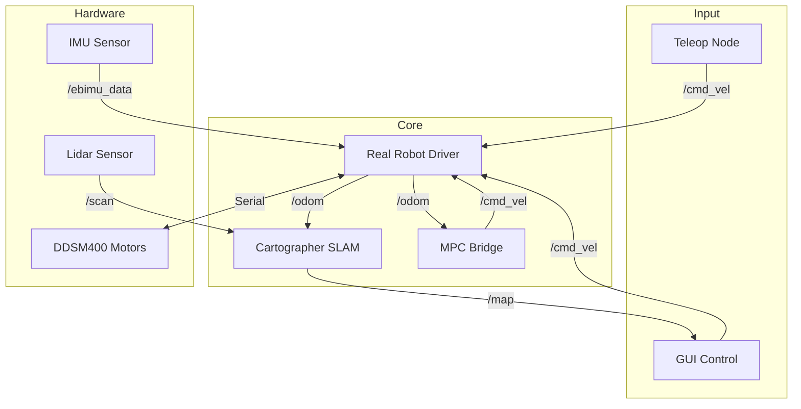

# Relay Robot Development (Relay Robot Proto-Type)

이 리포지토리는 차륜형 모바일 로봇(Differential Drive)의 제어, 센서 융합, SLAM 및 자율 주행을 위한 ROS 2 워크스페이스입니다.

> **💡 개발 팁:** 작업 중 막히는 부분이 있다면 이 문서를 먼저 정독하고, 해결되지 않을 경우 ROS 2 관련 커뮤니티나 ChatGPT를 활용하세요.

---

## 📂 패키지 가이드 (Package Catalog)

각 패키지의 역할과 주요 파일을 정리하였습니다. 작업을 시작하기 전 해당 패키지의 위치를 확인하세요.

| 패키지명 | 주요 역할 | 핵심 파일 / 경로 |
| :--- | :--- | :--- |
| **`relayrobot_description`** | **[가장 중요]** 로봇 모델(URDF), 통합 런치 파일, 전체 설정 | `urdf/relayrobot.xacro`, `launch/real_robot_260519.launch.py` |
| **`relayrobot_driver`** | 모터 드라이버 노드 (DDSM400) 및 기본 오도메트리 | `relayrobot_driver/motor_node_1.py` |
| **`sllidar_ros2`** | SLAMTEC LiDAR (A1/A2/A3) 드라이버 | `src/sllidar_node` |
| **`ebimu_pkg`** | EBIMU-9DOF 센서 드라이버 (Standard IMU Message) | `ebimu_pkg/ebimu_publisher.py` |
| **`gui_py`** | 텔레옵(Teleop) 및 프로세스 제어용 GUI | `gui_py/main.py` |
| **`ddsm_example`** | MPC 알고리즘 핵심 로직 및 모터 제어 예제 | `mpc_tubempc/TubeMPCPlanner.py` |
| **`mpc_tubempc_bridge`** | ROS 2와 MPC 알고리즘을 연결하는 가교 노드 | `src/mpc_tubempc_bridge/` |
| **`aws-robomaker-...`** | Gazebo 시뮬레이션용 병원 환경 맵 | `worlds/hospital.world` |

---

## 🛠️ 하드웨어 연결 및 사전 설정 (Setup)

실제 로봇 구동을 위해 다음 설정을 완료해야 합니다.

### 1. 시리얼 포트 권한 설정
로봇 PC에 연결된 USB 장치에 접근하기 위해 권한을 부여합니다.
```bash
sudo usermod -aG dialout $USER
# 설정 후 반드시 로그아웃 또는 재부팅을 하세요.
```

### 2. udev Rule 등록 (포트 고정)
LiDAR 포트를 `/dev/rplidar`로 고정하여 실행 시 혼선을 방지합니다.
```bash
cd src/sllidar_ros2/scripts
chmod +x create_udev_rules.sh
sudo ./create_udev_rules.sh
```

### 3. 하드웨어 포트 확인
연결된 장치가 다음 포트로 인식되는지 확인하세요.
- **모터 드라이버:** `/dev/ttyACM0`
- **IMU:** `/dev/ttyimu` (또는 `/dev/ttyUSB0`)
- **LiDAR:** `/dev/rplidar` (또는 `/dev/ttyUSB1`)

---

## 🚀 실행 가이드 (Operation Guide)

### 0. 기본 환경 로드 (모든 터미널 공통)
```bash
source /opt/ros/jazzy/setup.bash
colcon build --symlink-install
source install/setup.bash
```

### 🤖 시나리오 A: 실제 로봇 (Real Robot) 구동 순서
1. **[터미널 1] 하드웨어 드라이버 통합 실행**
   ```bash
   # 모터 + IMU 융합 오도메트리 + 라이더 통합 실행
   ros2 launch relayrobot_description real_robot_260519.launch.py
   ```
2. **[터미널 2] SLAM 맵핑 시작**
   ```bash
   ros2 launch relayrobot_description cartographer.launch.py
   ```
3. **[터미널 3] 시각화 및 조종**
   ```bash
   # RViz2 실행
   ros2 launch relayrobot_description display.launch.py
   # 키보드 조종 (선택)
   ros2 run teleop_twist_keyboard teleop_twist_keyboard
   ```
4. **[터미널 4] 다 그린 맵 저장하기**
   로봇을 조종해서 지도를 다 그렸다면, SLAM을 끄기 전에 아래 명령어로 맵을 저장합니다.
   ```bash
   ros2 run nav2_map_server map_saver_cli -f ~/my_map
   ```
   *(저장 후 `my_map.yaml`, `my_map.pgm` 파일이 생성됩니다.)*

---

### 🗺️ 시나리오 C: 저장된 맵에서 자율 주행 (Point A to B)
저장한 지도를 바탕으로 전역 경로 계획(A*)과 지역 제어(Tube MPC)를 활용하여 목표 지점까지 자율 주행을 수행합니다.

1. **[터미널 1] 하드웨어 드라이버 실행**
   ```bash
   ros2 launch relayrobot_description real_robot_260519.launch.py
   # (시뮬레이션인 경우: ros2 launch relayrobot_description gazebo.launch.py)
   ```
2. **[터미널 2] 저장된 맵 불러오기**
   Nav2의 `map_server`를 활용해 저장했던 지도를 퍼블리시합니다.
   ```bash
   ros2 run nav2_map_server map_server --ros-args -p yaml_filename:=$HOME/my_map.yaml
   # 맵 서버 활성화 (Lifecycle)
   ros2 run nav2_util lifecycle_bringup map_server
   ```
3. **[터미널 3] 경로 계획기 (Path Planner) 실행**
   A* 알고리즘을 사용해 지도상의 장애물을 피해가는 전역 경로(`global_path`)를 생성합니다.
   ```bash
   ros2 run mpc_tubempc_bridge mpc_tubempc_path_planner
   ```
4. **[터미널 4] MPC 제어기 (Controller) 실행**
   생성된 경로를 따라가도록 모터에 `/cmd_vel` 제어 명령을 내립니다.
   ```bash
   ros2 run mpc_tubempc_bridge mpc_tubempc_bridge
   ```
5. **RViz에서 목표 지점(Goal) 설정**
   - RViz2를 켜고 (`ros2 launch relayrobot_description display.launch.py`)
   - 상단 메뉴의 **`2D Goal Pose`** 버튼을 클릭하여 맵 위에서 로봇이 이동할 목적지(Point B)를 클릭 & 드래그하여 방향을 설정합니다.
   - (경로 계획기가 경로를 생성하고, MPC 제어기가 로봇을 부드럽게 이동시킵니다.)

### 🖥️ 시나리오 B: Gazebo 시뮬레이션 구동
```bash
ros2 launch relayrobot_description gazebo.launch.py
```
- 실제 로봇이 없어도 `/cmd_vel` 명령어로 가상 로봇을 움직일 수 있습니다.

---

## 🔍 상태 확인 및 문제 해결 (Troubleshooting)

### 센서 데이터가 정상인가요?
- **Odom 확인:** `ros2 topic echo /odom` (로봇을 손으로 밀었을 때 좌표가 바뀌는지 확인)
- **Lidar 확인:** `ros2 topic hz /scan` (약 7~10Hz 정도 나오면 정상)
- **IMU 확인:** `ros2 topic echo /ebimu_data` (로봇을 회전시켰을 때 orientation.z 값이 바뀌는지 확인)

### 자주 발생하는 문제
- **"Permission Denied":** 위 시리얼 포트 권한 설정을 확인하세요.
- **"Package not found":** `source install/setup.bash`를 했는지 확인하세요.
- **SLAM 맵이 겹침:** IMU 데이터가 튀거나 휠 오도메트리 오차가 크면 발생합니다. `real_robot_260519.launch.py`를 사용하고 있는지 확인하세요.

---

## 🔄 시스템 구조 다이어그램


---

## 📋 앞으로의 작업 (Roadmap)
1. **GUI 고도화:** `gui_py` 패키지에서 속도 제한(Limit) 설정 기능 추가.
2. **MPC 안정화:** 다양한 경로(Path)에 대한 추종 성능 테스트.
3. **자율 주행 통합:** Nav2 패키지를 활용한 목적지 기반 주행 구현.
