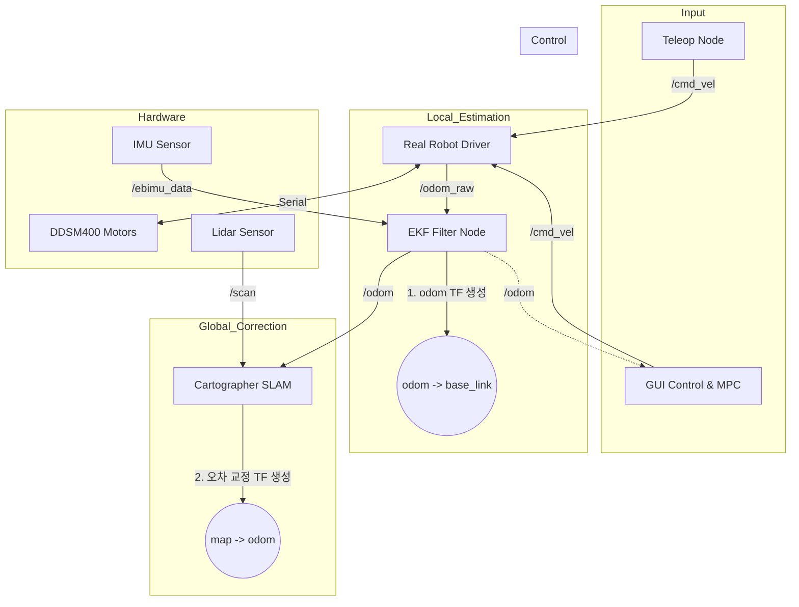

# Relay Robot Development (Relay Robot Proto-Type)

이 리포지토리는 차륜형 모바일 로봇(Differential Drive)의 제어, 센서 융합, SLAM 및 자율 주행을 위한 ROS 2 워크스페이스입니다.

> **💡 개발 팁:** 작업 중 막히는 부분이 있다면 이 문서를 먼저 정독하고, 해결되지 않을 경우 ROS 2 관련 커뮤니티나 ChatGPT를 활용하세요.

---

## 📂 패키지 가이드 (Package Catalog)

각 패키지의 역할과 주요 파일을 정리하였습니다. 작업을 시작하기 전 해당 패키지의 위치를 확인하세요.

| 패키지명 | 주요 역할 | 핵심 파일 / 경로 |
| :--- | :--- | :--- |
| **`relayrobot_description`** | **[가장 중요]** 로봇 모델(URDF), 통합 런치 파일, 전체 설정 | `urdf/relayrobot.xacro`, `launch/real_robot.launch.py` |
| **`relayrobot_driver`** | 모터 드라이버 노드 (DDSM400) 및 기본 오도메트리 | `relayrobot_driver/motor_node_1.py` |
| **`sllidar_ros2`** | SLAMTEC LiDAR (A1/A2/A3) 드라이버 | `src/sllidar_node` |
| **`ebimu_pkg`** | EBIMU-9DOF 센서 드라이버 (Standard IMU Message) | `ebimu_pkg/ebimu_publisher.py` |
| **`gui_py`** | 텔레옵(Teleop) 및 프로세스 제어용 GUI | `gui_py/main.py` |
| **`ddsm_example`** | MPC 알고리즘 핵심 로직 및 모터 제어 예제 | `mpc_tubempc/TubeMPCPlanner.py` |

---

## 🛠️ ROS 2 Humble 환경 설정 (Setup)

Ubuntu 22.04 및 ROS 2 Humble 환경에서 실제 로봇 구동을 위해 다음 설정을 완료해야 합니다.

### 1. 필수 패키지 및 라이브러리 설치
터미널을 열고 다음 명령어들을 실행하여 필요한 ROS 2 패키지와 Python 라이브러리를 설치합니다.
```bash
sudo apt update
# EKF 및 SLAM, 좌표 변환용 ROS 패키지
sudo apt install ros-humble-robot-localization ros-humble-cartographer-ros ros-humble-tf-transformations
# MPC 및 수학 연산용 Python 라이브러리
pip3 install transforms3d cvxpy polytope scipy
```

### 2. 시리얼 포트 권한 설정
로봇 PC에 연결된 USB 장치(Lidar, IMU, Motor)에 접근하기 위해 권한을 부여합니다.
```bash
sudo usermod -aG dialout $USER
# 설정 후 권한 적용을 위해 반드시 로그아웃 또는 컴퓨터를 재부팅하세요.
```

### 3. udev Rule 등록 (권장)
장치 포트를 고정하여 포트 번호 변경으로 인한 연결 오류를 방지합니다.
```bash
cd src/sllidar_ros2/scripts
chmod +x create_udev_rules.sh
sudo ./create_udev_rules.sh
```

### 4. 하드웨어 포트 확인
연결된 장치가 다음 기본 포트로 인식되는지 확인하세요. (필요 시 Launch 파일 수정)
- **모터 드라이버:** `/dev/ttyACM0`
- **IMU:** `/dev/ttyimu`
- **LiDAR:** `/dev/lidar` (또는 `/dev/ttyUSB*`)

---

## 🐛 최근 디버깅 및 아키텍처 업데이트 내역

최근 로봇 매핑 및 제어 안정성을 위해 다음과 같은 핵심적인 문제 해결 및 개선이 이루어졌습니다.

### 1. TF 트리 및 오도메트리 토픽 불일치 해결
- **문제점:** SLAM 및 매핑 시 렉이 발생하고 TF 연결이 끊어지는 문제가 있었습니다. 원인은 모터 노드가 `/odom`을 바로 발행하고, EKF 필터는 `/odom_raw`를 기대하여 중간에 파이프라인이 끊어졌기 때문입니다.
- **해결책:** 
  - `motor_node_1.py`가 순수 휠 데이터를 **`/odom_raw`**로 발행하도록 수정했습니다.
  - `real_robot.launch.py`에서 EKF 필터(`robot_localization`)가 이 데이터를 받아 IMU와 융합한 뒤, 그 결과를 **`/odom`** 토픽으로 리매핑하여 발행하도록 아키텍처를 교정했습니다.
  - **결과:** `map` → `odom` → `base_link`로 이어지는 TF 트리가 정상적으로 연결되어 카토그래퍼(SLAM)가 안정적으로 동작합니다.

### 2. GUI 안정성 및 실시간 피드백 강화
- **문제점:** GUI에서 센서나 SLAM 노드를 켜고 끌 때 프로세스가 불안정하게 종료되거나 중복 실행되는 이슈가 있었습니다.
- **해결책:**
  - `ProcessLauncher`를 개선하여 Linux 프로세스 그룹 단위(killpg)로 노드들을 확실하게 제어하도록 수정했습니다.
  - `gui_py/main.py`에 `/odom` 토픽 구독 기능을 추가하여 로봇의 실시간 좌표(X, Y)와 방향(Yaw)을 GUI 화면에 표시하도록 개선했습니다.

### 3. MPC 제어기 통합 및 위치 추적 기반 마련
- **문제점:** 기존 MPC는 단순히 일정 속도로 직진만 하는 구조였습니다.
- **해결책:**
  - `mpc_control.py`에서 현재 위치(`odom`)와 목표 위치(`target_pose`) 간의 거리 및 각도 오차를 실시간으로 계산하는 프레임워크를 구축했습니다.
  - 안전을 위한 비례 제어(Proportional Control) 기반의 Fallback 추적 로직을 추가했으며, 향후 `TubeMPCPlanner`의 최적화 로직과 직접 연동할 수 있도록 데이터 파이프라인을 정비했습니다. 모든 각도 연산은 Radian 단위로 안전하게 처리(Wrapping)됩니다.

---

## 🚀 실행 가이드 (Operation Guide)

### 0. 기본 환경 로드 (모든 터미널 공통)
```bash
source /opt/ros/humble/setup.bash
colcon build --symlink-install
source install/setup.bash
```

### 🤖 통합 실행 시나리오 (권장)
1. **[터미널 1] 하드웨어 드라이버 통합 실행**
   ```bash
   # 모터 + EKF 오도메트리 + 라이다 + IMU 통합 실행
   ros2 launch relayrobot_description real_robot.launch.py
   ```
2. **[터미널 2] GUI 실행 및 제어**
   ```bash
   ros2 run gui_py gui_py_node
   ```
   - GUI 패널에서 **Start SLAM** 버튼을 클릭하여 매핑을 시작합니다.
   - **Start MPC** 버튼을 클릭하여 로봇을 목표 지점으로 주행시킵니다.
   - (참고: 센서 노드들은 `real_robot.launch.py`에서 이미 켜졌으므로 GUI에서 Lidar/IMU를 중복으로 켜지 마세요.)

---

## 🔍 상태 확인 및 문제 해결 (Troubleshooting)

### 센서 데이터가 정상인가요?
- **Odom 확인:** `ros2 topic echo /odom` (EKF로 융합된 최종 오도메트리 데이터 확인)
- **Raw Odom 확인:** `ros2 topic echo /odom_raw` (순수 바퀴 엔코더 데이터 확인)
- **Lidar 확인:** `ros2 topic hz /scan` (약 7~10Hz 정도 나오면 정상)
- **IMU 확인:** `ros2 topic echo /ebimu_data` (로봇을 회전시켰을 때 orientation.z 값이 바뀌는지 확인)

### 자주 발생하는 문제
- **"ModuleNotFoundError: No module named 'cvxpy'":** MPC용 파이썬 라이브러리가 설치되지 않았습니다. `pip3 install cvxpy polytope scipy`를 실행하세요.
- **"Permission Denied":** 시리얼 포트 권한 설정 및 udev 룰이 정상 적용되었는지 확인하세요.
- **SLAM 맵이 겹침:** 휠 오도메트리 오차가 크면 발생합니다. `real_robot.launch.py`에서 EKF가 정상 작동 중인지 확인하세요 (`ros2 node list`에서 `ekf_filter_node` 확인).

---

## 🔄 시스템 구조 다이어그램 및 좌표계(TF) 흐름
로봇의 위치 추정은 EKF(Local)와 SLAM(Global) 두 단계에 걸쳐 이루어지며, 최종적으로 완벽하게 교정된 좌표계를 바탕으로 제어가 수행됩니다.


*   **EKF (1단계):** 바퀴와 IMU를 합쳐 짧은 시간 동안 빠르고 부드러운 위치(`odom -> base_link`)를 제공합니다.
*   **SLAM (2단계):** 라이다 스캔 데이터와 지도를 비교하여 EKF에서 발생한 누적 오차를 찾아내고, `map -> odom` 좌표계를 통해 최종 위치를 완벽하게 교정(Feedback)합니다.