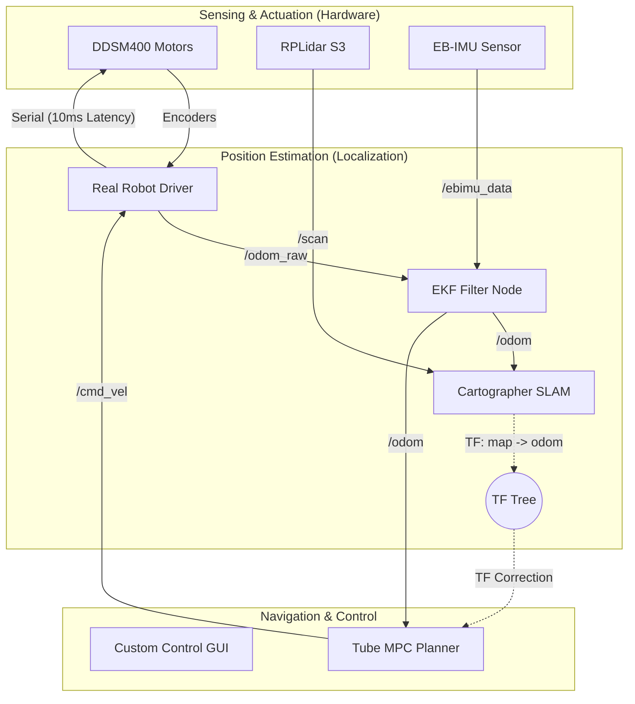

# Relay Robot Proto-Type — ROS 2 모바일 로봇 시스템

DDSM400 모터 + EBIMU9DOFV5 IMU + RPLidar S3 기반 차동 구동 모바일 로봇.  
Cartographer SLAM으로 지도 생성 → A* 경로 계획 → Tube-MPC 제어기로 자율 주행.

> **지원 ROS 버전:** ROS 2 Jazzy (Ubuntu 24.04) / ROS 2 Humble (Ubuntu 22.04)

---

## 시스템 아키텍처



---

## 파일 구조

```
src/
├── relayrobot_description/
│   ├── config/
│   │   ├── ekf.yaml                     # EKF 설정
│   │   └── my_cartographer.lua          # Cartographer SLAM 파라미터
│   ├── launch/
│   │   ├── real_robot_260519.launch.py  # 전체 하드웨어 런치
│   │   └── cartographer.launch.py       # SLAM 런치
│   ├── scripts/
│   │   └── setup_udev_rules.sh          # USB 포트 고정 스크립트
│   └── urdf/relayrobot.xacro            # 로봇 3D 모델
│
├── ebimu_pkg/
│   └── ebimu_pkg/ebimu_publisher.py     # IMU 드라이버 노드
│
├── sllidar_ros2/                        # RPLidar 드라이버 (C++)
│
├── mpc_tubempc_bridge/
│   └── src/mpc_tubempc_bridge/
│       ├── bridge_node.py               # Tube-MPC 노드
│       └── path_planner.py              # A* 경로 계획 노드
│
├── ddsm_example/mpc_tubempc/
│   ├── TubeMPCPlanner.py                # Tube-MPC 알고리즘
│   └── ReferenceGenerator.py
│
└── gui_py/
    └── gui_py/main.py
```

---

## 하드웨어 포트 매핑

| 장치 | 심볼릭 링크 | 프로토콜 |
|------|-------------|----------|
| DDSM HAT(B) 모터 컨트롤러 | `/dev/motor` → ttyACM0 | USB-CDC, 115200 bps |
| EBIMU9DOFV5 IMU | `/dev/ttyimu` → ttyUSB0 | UART, 115200 bps |
| RPLidar S3 | `/dev/rplidar` → ttyUSB1 | UART, 1000000 bps |

> 위 매핑은 udev 규칙으로 자동 고정됩니다. 설정 방법은 아래 "USB 포트 고정" 섹션을 참고하세요.

---

## 토픽 / TF 흐름

```
[하드웨어]              [드라이버 노드]                [토픽]
/dev/motor   ──►  real_robot_driver_260519  ──►  /odom_raw  (nav_msgs/Odometry)
                                            ──►  /joint_states
                  sub: /cmd_vel ◄──────────────────────────
/dev/ttyimu  ──►  ebimu_publisher           ──►  /ebimu_data (sensor_msgs/Imu)
/dev/rplidar ──►  sllidar_node              ──►  /scan       (sensor_msgs/LaserScan)

[센서 융합]
/odom_raw ──┐
            ├──►  ekf_filter_node  ──►  /odom (nav_msgs/Odometry)
/ebimu_data ┘                      ──►  TF: odom → base_link

[SLAM]
/scan + TF  ──►  cartographer_node  ──►  /map
                                    ──►  TF: map → odom

[TF 트리]
map ──[cartographer]──► odom ──[ekf_node]──► base_link ──[robot_state_publisher]──► lidar_v1_1
```

| 토픽 | 타입 | 발행 노드 |
|------|------|-----------|
| `/odom_raw` | `nav_msgs/Odometry` | real_robot_driver_260519 |
| `/odom` | `nav_msgs/Odometry` | ekf_filter_node |
| `/ebimu_data` | `sensor_msgs/Imu` | ebimu_publisher |
| `/scan` | `sensor_msgs/LaserScan` | sllidar_node |
| `/map` | `nav_msgs/OccupancyGrid` | cartographer_node |
| `/cmd_vel` | `geometry_msgs/Twist` | bridge_node |

---

## 최초 설치 (1회)

### 1. ROS 패키지 설치

**Jazzy (Ubuntu 24.04):**
```bash
sudo apt update && sudo apt install -y \
  ros-jazzy-robot-localization \
  ros-jazzy-cartographer-ros \
  ros-jazzy-tf-transformations \
  ros-jazzy-teleop-twist-keyboard
```

**Humble (Ubuntu 22.04):**
```bash
sudo apt update && sudo apt install -y \
  ros-humble-robot-localization \
  ros-humble-cartographer-ros \
  ros-humble-tf-transformations \
  ros-humble-teleop-twist-keyboard
```

Python 의존 패키지:
```bash
pip3 install numpy scipy cvxpy polytope osqp cvxopt transforms3d
```

---

### 2. ROS 환경 소싱 자동화 (alias 설정)

매번 `source /opt/ros/jazzy/setup.bash`를 치는 대신, alias 하나로 해결합니다. **최초 1회만 실행하면 이후 모든 터미널에서 사용 가능합니다.**

**Jazzy 사용자:**
```bash
echo 'alias ros_setup="source /opt/ros/jazzy/setup.bash && source ~/mobile_robot_proto_type/install/setup.bash && echo ROS2 환경 로드 완료"' >> ~/.bashrc
source ~/.bashrc
```

**Humble 사용자:**
```bash
echo 'alias ros_setup="source /opt/ros/humble/setup.bash && source ~/mobile_robot_proto_type/install/setup.bash && echo ROS2 환경 로드 완료"' >> ~/.bashrc
source ~/.bashrc
```

이후 새 터미널을 열 때마다:
```bash
ros_setup
```

> **매번 자동 소싱이 필요하면** alias 대신 `echo 'source /opt/ros/jazzy/setup.bash' >> ~/.bashrc` 로 직접 등록하세요.  
> 단, ROS가 없는 환경에서 터미널을 열면 오류가 출력됩니다.

---

### 3. USB 포트 고정 (udev 규칙)

Linux는 USB 장치를 꽂는 순서대로 `/dev/ttyUSB0`, `/dev/ttyUSB1` 번호를 붙이기 때문에, 재부팅하면 라이다와 IMU의 포트 번호가 뒤바뀔 수 있습니다. udev 규칙을 설정하면 **재부팅·재연결 후에도 장치 이름이 항상 고정**됩니다.

#### Step 1: 장치 식별

라이다, IMU, 모터 컨트롤러를 모두 연결한 뒤 아래 명령으로 어떤 포트에 어떤 장치가 연결됐는지 확인합니다.

```bash
for dev in /dev/ttyUSB* /dev/ttyACM*; do
  echo "=== $dev ===" && udevadm info -a -n "$dev" | grep -E 'ATTRS\{product\}|ATTRS\{serial\}' | head -2
done
```

출력 예시:
```
=== /dev/ttyUSB0 ===
    ATTRS{product}=="CP2102 USB to UART Bridge Controller"    ← EB-IMU
=== /dev/ttyUSB1 ===
    ATTRS{product}=="CP2102N USB to UART Bridge Controller"   ← RPLidar S3
=== /dev/ttyACM0 ===
    ATTRS{product}=="USB Single Serial"                       ← 모터 컨트롤러
```

| 칩 | 장치 |
|----|------|
| `CP2102` (구형) | EB-IMU |
| `CP2102N` (신형) | RPLidar S3 |
| `USB Single Serial` (QinHeng) | 모터 컨트롤러 → 항상 ttyACM0 |

> 포트 번호(USB0/USB1)가 뒤바뀌어도 상관없습니다. 칩 종류로 장치를 식별하므로 꽂는 순서는 무관합니다.

#### Step 2: 규칙 적용

아래 명령을 그대로 실행하세요. (setup_udev_rules.sh 대신 이 방법을 권장합니다)

```bash
sudo cp ~/mobile_robot_proto_type/src/relayrobot_description/scripts/99-robot-devices.rules /etc/udev/rules.d/ \
  && sudo udevadm control --reload-rules \
  && sudo udevadm trigger
```

USB를 모두 뽑았다가 다시 꽂은 후 확인:
```bash
ls -la /dev/rplidar /dev/ttyimu /dev/motor
```

정상 출력:
```
lrwxrwxrwx ... /dev/motor   -> ttyACM0
lrwxrwxrwx ... /dev/rplidar -> ttyUSB1
lrwxrwxrwx ... /dev/ttyimu  -> ttyUSB0
```

---

### 4. 워크스페이스 빌드

```bash
cd ~/mobile_robot_proto_type
ros_setup   # 또는 source /opt/ros/jazzy/setup.bash
colcon build --symlink-install --packages-ignore aws-robomaker-hospital-world
echo 'source ~/mobile_robot_proto_type/install/setup.bash' >> ~/.bashrc
source ~/.bashrc
```

> `--symlink-install` 필수: bridge_node.py가 소스 경로 기반으로 TubeMPCPlanner를 import합니다.  
> `aws-robomaker-hospital-world`는 Gazebo 시뮬레이션 전용이므로 실제 로봇 구동 시 제외합니다.

---

## 단계별 실행 가이드

> 모든 터미널에서 `ros_setup` 실행 후 사용하세요.

---

### STAGE 1: 모터 단독 테스트

**목표:** DDSM400 시리얼 통신 확인, 전진/후진/회전 명령에 실제 응답 확인

```bash
# [터미널 1] 모터 + 휠 오도메트리 노드
ros2 run relayrobot_description real_robot_driver_260519

# [터미널 2] 전진 명령
ros2 topic pub /cmd_vel geometry_msgs/msg/Twist \
  "{linear: {x: 0.1}, angular: {z: 0.0}}" --once

# 정지
ros2 topic pub /cmd_vel geometry_msgs/msg/Twist \
  "{linear: {x: 0.0}, angular: {z: 0.0}}" --once

# [터미널 3] 오도메트리 확인
ros2 topic echo /odom_raw --field twist.twist.linear
```

**성공 기준:** `/odom_raw`의 `twist.linear.x ≈ 0.1 (±30%)`, 로봇 실제 전진

**실패 체크리스트:**
```
[ ] ls -la /dev/motor           → 없으면 USB 재연결 후 udev 재확인
[ ] ESP32 모드 점퍼 확인          → Arduino 모드면 JSON 무응답
[ ] ros2 run 실행 로그에 "Connected" 출력 확인
```

---

### STAGE 2: IMU 단독 테스트

**목표:** EBIMU 데이터 수신, yaw 방향 정합성 확인

> **주의:** 노드 시작 후 10초간 캘리브레이션이 진행됩니다. 이 시간 동안 로봇을 움직이지 마세요.

```bash
# [터미널 1] IMU 노드
ros2 run ebimu_pkg ebimu_publisher \
  --ros-args -p port:=/dev/ttyimu -p frame_id:=base_link

# [터미널 2] 데이터 확인
ros2 topic hz /ebimu_data          # 목표: 40~60 Hz
ros2 topic echo /ebimu_data --field orientation
```

**성공 기준:** 40~60 Hz 발행, 로봇을 왼쪽(반시계)으로 돌리면 yaw 값 증가

**실패 체크리스트:**
```
[ ] ls -la /dev/ttyimu              → 없으면 udev 재설정
[ ] 로그에 "Calibration done!" 확인  → 없으면 10초 더 대기
[ ] python3 src/ebimu_pkg/ebimu_pkg/imu_test_1.py  → raw 시리얼 데이터 직접 확인
```

---

### STAGE 3: LiDAR 단독 테스트

**목표:** /scan 발행 확인, RViz에서 장애물 시각화

```bash
# [터미널 1] LiDAR 노드 (RPLidar S3)
ros2 run sllidar_ros2 sllidar_node \
  --ros-args \
  -p serial_port:=/dev/rplidar \
  -p serial_baudrate:=1000000 \
  -p frame_id:=lidar_v1_1 \
  -p scan_mode:=DenseBoost

# [터미널 2]
ros2 topic hz /scan                # 목표: 10 Hz 이상

# [터미널 3] RViz
rviz2
# Fixed Frame: lidar_v1_1 / Add: LaserScan → Topic: /scan
```

**성공 기준:** 10 Hz 이상 발행, RViz에서 주변 벽이 점으로 표시됨

**실패 체크리스트:**
```
[ ] ls -la /dev/rplidar            → 없으면 udev 재설정
[ ] LiDAR 모터 회전 확인 (소리/진동)
[ ] Operation timeout 오류 → /dev/rplidar가 ttyUSB1을 가리키는지 확인
    (S3는 CP2102N 칩 = ttyUSB1)
[ ] scan_mode 오류 시 → -p scan_mode:=Standard 로 변경
```

---

### STAGE 4: Odometry (EKF 융합) 테스트

**목표:** 바퀴 오도메트리 + IMU → EKF 융합 → /odom 발행, TF 트리 완성

**선행 조건:** STAGE 1, 2, 3 통과

```bash
# [터미널 1] 전체 하드웨어 launch
ros2 launch relayrobot_description real_robot_260519.launch.py

# [터미널 2] 확인
ros2 topic list          # /odom, /odom_raw, /ebimu_data, /scan 모두 보여야 함
ros2 topic hz /odom      # 목표: ~30 Hz
ros2 run tf2_ros tf2_echo odom base_link

# [터미널 3] 직진 1m 후 위치 확인
ros2 topic echo /odom --field pose.pose.position
```

**성공 기준:**
- `/odom` 30 Hz 발행
- `tf2_echo odom base_link`에서 transform 출력
- 1m 직진 시 `position.x ≈ 0.9~1.1`

**실패 체크리스트:**
```
[ ] robot_localization 설치: ros2 pkg list | grep robot_localization
[ ] /odom_raw 발행 확인 (STAGE 1 선행)
[ ] ekf.yaml 경로:
    ls $(ros2 pkg prefix relayrobot_description)/share/relayrobot_description/config/ekf.yaml
```

---

### STAGE 5: SLAM (Cartographer) 매핑

**목표:** 지도 생성, TF map→odom 발행 확인

**선행 조건:** STAGE 4의 `real_robot_260519.launch.py`가 실행 중이어야 함

```bash
# [터미널 2] Cartographer 실행
ros2 launch relayrobot_description cartographer.launch.py

# [터미널 3] 확인
ros2 topic hz /map
ros2 run tf2_ros tf2_echo map odom

# [터미널 4] 키보드 조종
ros2 run teleop_twist_keyboard teleop_twist_keyboard

# [터미널 5] RViz
rviz2
# Fixed Frame: map / Add: Map(/map), LaserScan(/scan), TF
```

**지도 저장:**
```bash
ros2 run nav2_map_server map_saver_cli -f ~/robot_map
```

**실패 체크리스트:**
```
[ ] cartographer_ros 설치: ros2 pkg list | grep cartographer
[ ] lidar frame_id 확인: ros2 topic echo /scan --field header.frame_id
    → "lidar_v1_1" 이어야 함
[ ] STAGE 4 launch가 실행 중인지 확인
```

---

### STAGE 6: MPC 제어기 자율주행

**목표:** 목표 좌표 → A* 경로 계획 → Tube-MPC 추종

**선행 조건:** STAGE 5 통과, `polytope`·`cvxpy`·`cvxopt` 설치 완료

```bash
# [터미널 1] 하드웨어 launch (유지)
ros2 launch relayrobot_description real_robot_260519.launch.py

# [터미널 2] Cartographer (유지)
ros2 launch relayrobot_description cartographer.launch.py

# [터미널 3] A* 경로 계획 노드
ros2 run mpc_tubempc_bridge mpc_tubempc_path_planner

# [터미널 4] MPC Bridge 노드
ros2 run mpc_tubempc_bridge mpc_tubempc_bridge \
  --ros-args \
  -p use_goal_topic:=true \
  -p use_global_path:=true \
  -p velocity_limit:=0.2 \
  -p omega_limit:=1.0 \
  -p horizon:=6

# [터미널 5] 목표 좌표 발행 (1~2m 이내 짧은 거리부터)
ros2 topic pub /mpc_goal geometry_msgs/msg/PoseStamped \
  "{header: {frame_id: 'map'}, pose: {position: {x: 1.0, y: 0.0, z: 0.0}, orientation: {w: 1.0}}}" \
  --once
```

**실패 체크리스트:**
```
[ ] ImportError (TubeMPCPlanner) → colcon build --symlink-install 재빌드
[ ] ImportError (polytope/cvxpy) → pip3 install polytope cvxpy osqp cvxopt
[ ] /global_path 없음 → Cartographer 실행 확인 (/map 수신 대기 중)
[ ] "Start or goal cell is not free" → 장애물 위 좌표, 다른 지점 시도
[ ] MPC QP failed → velocity_limit:=0.1, horizon:=4 로 줄여서 재시도
```

---

## 하드웨어 설치 팁

### IMU(EB-IMU) 설치 가이드

- **최적 위치:** 두 바퀴 축의 정중앙 (회전 중심)
- **방향 (REP-103):** X축 = 전진 방향, Y축 = 왼쪽, Z축 = 위
- **수평 유지:** 기울어지면 중력 가속도가 섞임
- **진동 절연:** 얇은 고무 패드나 폼 테이프 위에 부착 권장

### DDSM HAT(B) 연결 주의사항

#### 반드시 ESP32 모드로 연결

DDSM HAT(B)는 Arduino / ESP32 두 모드를 지원합니다. **이 프로젝트는 ESP32 모드 필수.**
- ESP32 모드 → `/dev/ttyACM0` 으로 인식
- 모드가 다르면 포트가 잡혀도 JSON 명령 무시됨

#### cmd 값 스케일링

| cmd 값 | 실제 RPM |
|--------|---------|
| 100 | 10 RPM |
| 600 | 60 RPM |

> **공식:** `실제 RPM = cmd ÷ 10`

#### 단독 통신 테스트

```bash
python3 src/relayrobot_driver/relayrobot_driver/motor_test_1.py
```

### 모터 제어 지연

모터 명령 간 지연 시간을 **10ms**로 최적화. (`motor_drive_1.py` 적용 완료)

---

## TF 좌표계 이해

| 좌표계 | 의미 | 책임 노드 |
|--------|------|-----------|
| `base_link` | 로봇의 물리적 중심 | robot_state_publisher |
| `odom` | 출발점 기준 상대 위치 | ekf_filter_node |
| `map` | 실제 세계(지도) 기준 위치 | cartographer |

**odom_raw vs odom를 분리한 이유:**
- `odom_raw`: 순수 휠 인코더 기반 (미끄러짐 오차 포함)
- `odom`: odom_raw + IMU를 EKF로 융합 → SLAM의 map→odom 보정 실시간 반영

**제어기가 /odom을 쓰는데 SLAM 보정이 되는 이유:**  
EKF가 `odom→base_link`를 발행하고, SLAM이 `map→odom`을 보정합니다.  
전역 플래너는 두 TF를 곱해 `map 기준 로봇 위치`를 계산하므로, 결국 지도의 목표점에 정확히 도착합니다.

---

## 원격 통신 설정

```bash
# Robot PC / Remote PC 모두 동일한 값으로 설정 (0~232)
echo 'export ROS_DOMAIN_ID=30' >> ~/.bashrc
source ~/.bashrc
```

연결 확인:
```bash
# Remote PC에서
ping [Robot_IP]
ros2 topic list          # Robot PC에서 노드 실행 중일 때 토픽이 보이면 성공
```

---

## 트러블슈팅

### 모터 미응답
```bash
python3 src/relayrobot_driver/relayrobot_driver/motor_test_1.py
# "Connected" 출력 안 되면: USB → ESP32 모드 점퍼 → 전원 순서로 확인
```

### EKF /odom 미발행
```bash
ros2 pkg list | grep robot_localization
# 없으면: sudo apt install ros-jazzy-robot-localization
```

### Cartographer apt 설치 안 될 때 (Jazzy)
```bash
sudo apt install ros-jazzy-slam-toolbox
ros2 launch slam_toolbox online_async_launch.py \
  params_file:=src/relayrobot_description/my_slam_params.yaml
```

### RViz에서 로봇 떨림 (TF 이중 발행)
```bash
ros2 run tf2_ros tf2_monitor
# odom→base_link 발행자가 2개면 real_robot_driver의 TF 브로드캐스터 비활성화
# (real_robot_driver_260519.py는 이미 비활성화됨)
```

### MPC 발산 / 진동
```bash
# 제약 완화
ros2 run mpc_tubempc_bridge mpc_tubempc_bridge \
  --ros-args -p velocity_limit:=0.1 -p horizon:=4
```

### udev 심볼릭 링크 없음
```bash
# 포트 식별 재확인
for dev in /dev/ttyUSB* /dev/ttyACM*; do
  echo "=== $dev ===" && udevadm info -a -n "$dev" | grep 'ATTRS{product}' | head -1
done

# 규칙 재적용
sudo cp ~/mobile_robot_proto_type/src/relayrobot_description/scripts/99-robot-devices.rules /etc/udev/rules.d/
sudo udevadm control --reload-rules && sudo udevadm trigger
# USB 뽑았다가 다시 꽂기
```

---

## 주요 디버깅 이력

### EB-IMU 시리얼 파싱 오류 수정 (2026-06-14)
- `readline()`이 `\r\n`을 두 줄로 읽어 `0.003.001`처럼 붙어서 파싱 실패
- 해결: `.replace('\r','').replace('\n','')` + `*` 시작 확인 + 9개 필드 검증
- YAW wraparound(0~360°) → `-180~+180°` 변환 추가
- 10초 정지 캘리브레이션으로 ACC/GYRO 바이어스 자동 제거

### DDSM HAT(B) 첫 통신 확인 (2026-06-14)
- ESP32 모드 미설정으로 JSON 명령 무응답
- `cmd 100 = 10 RPM` 스케일링 주의 필요

### 좌표계 떨림 (Double TF Conflict)
- 모터 드라이버와 EKF 노드가 동시에 `odom→base_link` TF 발행
- 해결: 드라이버의 TF 브로드캐스터 비활성화, EKF만 발행

### MPC "장님" 주행
- 제어기가 목표치만 던지고 현재 위치 피드백 없음
- 해결: `/odom` 구독 추가, 실시간 Distance/Angle Error 피드백 루프 완성
