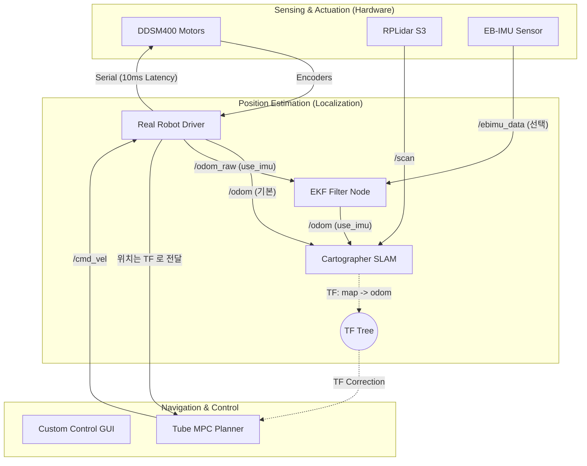

# Relay Robot Proto-Type — ROS 2 모바일 로봇 시스템

DDSM400 모터 + RPLidar(S2/S3 계열) 기반 차동 구동 모바일 로봇. IMU 는 선택.  
Cartographer SLAM으로 지도 생성 → A* 경로 계획 → Tube-MPC 제어기로 자율 주행.

> ## ⚠️ 2026-09-22 — 기본 구성이 바뀌었습니다
>
> **IMU 는 선택 사항입니다.** 2D SLAM 에서 yaw 를 잡는 주체는 IMU 가 아니라
> 라이다 scan matching 이므로, IMU/EKF 없이 동작합니다.
>
> | | 기본 (`use_imu:=false`) | 예전 구성 (`use_imu:=true`) |
> |---|---|---|
> | `/odom` 발행 | **드라이버** | ekf_filter_node |
> | `odom→base_link` TF | **드라이버** | ekf_filter_node |
> | 드라이버 원본 토픽 | `/odom` | `/odom_raw` |
> | IMU 노드 | 안 띄움 | 띄움 |
>
> **아래 문서 곳곳의 `/odom_raw` 와 "EKF 가 TF 를 낸다" 는 `use_imu:=true` 기준입니다.**
> 기본 구성의 최신 설명은 `README_ROBOT.md` 와 `docs/DEBUG_LOG_2026-09-22.md` 를 보세요.
>
> 매핑 중에는 **각속도 ≤ 0.5 rad/s, 선속도 ≤ 0.3 m/s** 를 지킵니다 (IMU 가 없으면
> 스캔 내 모션 왜곡을 보정할 수단이 없습니다). teleop 기본값은 그 2배라 따로 낮춰야
> 합니다: `-p speed:=0.15 -p turn:=0.4`.
>
> 안 쓰는 파일은 `old_file/` 로 옮겼습니다 (`old_file/README.md`).

> **지원 ROS 버전:** ROS 2 Jazzy (Ubuntu 24.04) / Humble (Ubuntu 22.04) / Foxy (Ubuntu 20.04)

### 우분투·ROS 배포판 호환표

| 항목 | Foxy (20.04) | Humble (22.04) | Jazzy (24.04) |
|------|--------------|----------------|---------------|
| `colcon build` (5개 패키지 전부) | ✅ 빌드 확인됨 | ✅ | ✅ |
| 실기 파이프라인 (모터·IMU·LiDAR·EKF·Cartographer·MPC) | ✅ | ✅ | ✅ |
| `gazebo.launch.py` 시뮬레이션 | ✅ | ✅ | ❌ **불가** |
| 시스템 Python | 3.8 | 3.10 | 3.12 |

**Jazzy에서 Gazebo 시뮬레이션이 안 되는 이유:** `urdf/relayrobot.xacro`·`relayrobot.gazebo`가
Gazebo Classic 플러그인(`libgazebo_ros_diff_drive.so`, `libgazebo_ros_ray_sensor.so`,
`libgazebo_ros_joint_state_publisher.so`)을 쓰는데, Gazebo Classic은 2025년 1월 EOL이라
`ros-jazzy-gazebo-ros` 패키지가 없습니다. Jazzy에서 시뮬레이션을 돌리려면 `ros_gz_sim` +
`gz_ros2_control` 기반으로 URDF를 다시 써야 합니다. **실기 주행은 Jazzy에서도 정상 동작**합니다
(시뮬레이션 런치만 못 씀).

**코드 자체는 배포판 중립입니다.** rclpy/launch API를 배포판별로 갈리는 방식으로 쓰지 않고,
`np.float`·`np.int` 같은 NumPy 2.0에서 제거된 별칭도 없어서 20.04~24.04 어디서든 그대로 빌드됩니다.
바뀌는 건 아래 apt 명령의 배포판 이름뿐입니다.

---

## 시스템 아키텍처



---

## 개발 로드맵

```
Phase 0 ✅  하드웨어 검증      Motor / IMU / LiDAR 단독 테스트 + GUI
Phase 1 ▶  Odometry 정밀 검증  EKF 융합 odom 정확도 확인 → SLAM 입력 기준 확보
Phase 2    Cartographer SLAM   지도 생성 + map→odom TF 안정성 확인
Phase 3 🧪 경로 계획 검증       A* 경로 계획기 + /global_path 토픽 시각화
Phase 4 🧪 Tube-MPC 통합       짧은 구간 추종 → 파라미터 튜닝
Phase 5    완전 자율주행        전체 파이프라인 통합 + 성능 검증

  🧪 = 코드 완성 + 시뮬레이션(STAGE 5.5) 검증 완료. 실기 검증만 남음 (2026-09-13)
```

> **막혀 있는 곳은 코드가 아니라 하드웨어다.** Phase 3·4 의 코드(A*, Tube-MPC)는 이미
> 다 있고 `tools/mpc_sim.py` 리허설로 끝까지 주행까지 확인했다. 순서상 Phase 1(odom 캘리브)과
> Phase 2(SLAM)를 실기로 통과해야 그 위에 얹을 수 있을 뿐이다.
> **Phase 2(SLAM)는 새로 작성할 코드가 없다** — `cartographer.launch.py` 로 바로 간다.

### Phase 1 — Odometry 정밀 검증 (현재)

| 항목 | 확인 내용 | 완료 기준 |
|------|-----------|-----------|
| RPM 팩터 | `/600.0` 변환 실측 | 1m 직진 → `x ≈ 0.9~1.1` |
| wheel_base | `0.165m` 실측 대조 | 90° 회전 → `yaw ≈ 1.4~1.7 rad` |
| EKF 융합 | IMU 보정 효과 | 직진 후 yaw drift 없음 |
| TF tree | `odom→base_link` 발행 | `tf2_echo` 값 출력 |

### Phase 2 — Cartographer SLAM

- **입력:** `/odom` (EKF 융합) + `/scan` + TF tree
- **핵심 검증:** `map→odom` TF 발행 여부, 지도 닫힘(loop closure) 확인
- **산출물:** `~/robot_map.yaml` + `~/robot_map.pgm` 저장
- **이슈 예상:** `my_cartographer.lua` 튜닝 (특히 실내 공간 크기에 맞는 `map_resolution`)

#### ⚠️ odom 품질이 SLAM을 좌우하는 이유 (Phase 1을 먼저 하는 이유)

SLAM에서 **odom은 "정답"이 아니라 scan 매칭의 "초기 추측값(prior)"** 입니다.
Cartographer는 odom으로 "대충 이만큼 움직였겠다"를 예측하고, **그 근처에서 scan을
맵에 맞춰** 미세조정합니다. 그래서 odom이 *전역적으로 정확*할 필요는 없지만
**국소적으로 매끄럽고(점프 없이) + 스케일이 맞고 + yaw가 안정적**이어야 합니다.

**불안정 유형별로 scan이 잡아주는 정도가 다릅니다:**

| odom 불안정 유형 | scan이 보정하나? |
|------------------|------------------|
| 느린 드리프트 / 스케일 오차 (1m인데 0.9m) | ✅ 매 프레임 맵에 맞춰 보정 + loop closure가 누적분 사후 교정 |
| 고주파 노이즈 / 순간 점프 (jitter, 튐) | ⚠️ 초기 추측이 확 틀어지면 scan이 **엉뚱한 위치로 수렴** |
| yaw(회전) 오차 | ❌ 가장 치명적 — 위치 오차보다 scan 매칭을 훨씬 크게 망침 |

**보정 장치 (`my_cartographer.lua`):**
- `use_online_correlative_scan_matching = true` → Ceres 정밀매칭 *전에* 넓은 범위를
  brute-force 탐색 → odom 추측이 좀 틀려도 복구 (불안정 odom의 1차 방어선, CPU 더 씀)
- Ceres scan matcher → odom 추측 ↔ scan을 가중치로 절충
- Global SLAM (pose graph + loop closure) → 누적 드리프트를 사후 교정

**꼭 기억할 두 가지:**
1. 이 설정은 `use_imu_data = false` 라 **Cartographer가 IMU를 직접 안 씁니다.** IMU는
   오직 EKF → `/odom` 경로로만 들어가요. 즉 **(바퀴+IMU yaw 융합) odom 품질 = SLAM
   prior 품질** 그 자체. odom이 불안정하면 그대로 SLAM 입력으로 갑니다.
2. **특징 빈약 환경**(긴 직선 복도, 텅 빈 큰 방, 유리벽, LiDAR `max_range` 8m 밖)에서는
   scan이 위치를 못 고정해 **odom에 거의 전적으로 의존** → 이때 odom 불안정이 그대로 드러남.

**튜닝 포인트:**
- SLAM이 odom 때문에 흔들리면 → `TRAJECTORY_BUILDER_2D.ceres_scan_matcher` 의
  `translation_weight`/`rotation_weight` 를 낮춰 scan을 더 신뢰.
- 특징 없는 복도에서 미끄러지면 → 위 weight를 올려 odom을 더 신뢰.

> **한 줄 요약:** 느린 드리프트는 scan이 잡아주지만 **odom의 점프·yaw 오차는 못 잡는다.**
> 그래서 Phase 1에서 odom을 매끄럽게(RPM 팩터·wheel_base 캘리브) 만드는 게 SLAM 안정성의 전제다.

### Phase 3 — 경로 계획 검증

- **입력:** `/map` + 목표 좌표(`/mpc_goal`)
- **핵심 검증:** `/global_path`에 경로 토픽 발행 확인, 원격 PC RViz에서 경로 시각화
- **이슈 예상:** 지도 해상도와 A* 격자 크기 불일치 → `path_planner.py` 파라미터 조정

### Phase 4 — Tube-MPC 통합

- **1차:** 1~2m 직선 경로 추종 (짧게 먼저)
- **2차:** 곡선 경로 추종 + 파라미터 튜닝 (`horizon`, `velocity_limit`, `omega_limit`)
- **이슈 예상:** QP 풀이 발산 → `horizon:=4`, `velocity_limit:=0.1` 로 줄여서 시작

### Phase 5 — 완전 자율주행

- 전체 런치 단일 파일화
- 장애물 재계획 확인
- 비상 정지(`/cmd_vel` zeroing) 안전 기능

### 향후 개발 방향 (Phase 5 이후)

Phase 0~5가 "한 대가 지도를 만들고 목표점까지 스스로 간다"까지라면, 그 다음은 **반복 운용이 가능한 서비스 로봇**으로 확장하는 단계입니다.

| 방향 | 내용 | 왜 필요한가 |
|------|------|-------------|
| **지도 재사용 (Localization 모드)** | 매번 SLAM으로 새 지도를 만들지 않고, 저장된 `robot_map` + Cartographer pure localization(또는 AMCL)으로 기존 지도에서 위치만 추정 | 운용 단계에서는 지도 생성이 아니라 "아는 공간에서 반복 주행"이 기본. SLAM 상시 구동은 CPU 낭비 + 지도 오염 위험 |
| **Nav2 스택 병행 평가** | 자작 A*+Tube-MPC와 Nav2(planner/controller server)를 같은 코스에서 비교. 자작 MPC는 Nav2 controller 플러그인으로 이식 가능 | 자작 스택은 학습·튜닝 자유도가 높지만, 복구 행동(recovery)·코스트맵 갱신·라이프사이클 관리는 Nav2가 이미 검증됨 |
| **동적 장애물 대응** | 현재는 정적 지도 기반 A* 재계획 수준 → local costmap + 속도 장애물(사람) 감속/정지 계층 추가 | 실환경 투입의 최소 안전 요건. Tube-MPC의 tube 제약과 자연스럽게 결합 가능 |
| **멀티센서 융합 강화** | 뎁스 카메라 추가(라이다 평면 밖 장애물 — 낮은 턱, 테이블 상판), EKF에 시각 오도메트리 보조 | 2D LiDAR 단독의 구조적 사각(높이 정보 없음) 보완 |
| **매니퓰레이터 연계 (모바일 매니퓰레이션)** | Relay Robot이라는 이름대로, 정지 스테이션의 로봇 팔(예: Trossen arm 셀)과 도킹 → 부품/트레이 릴레이 운반 | 이동(이 프로젝트) + 조작(multi_robot_api)을 잇는 최종 목표 시나리오 |
| **운용 안정화** | 단일 launch + systemd 자동 기동, 배터리/통신 감시, `/cmd_vel` watchdog(통신 두절 시 자동 정지) | 데모가 아니라 "켜두면 도는" 로봇의 조건 |

> **진행 원칙은 로드맵과 동일**: 한 번에 하나씩, 하위 계층 검증 없이 상위 계층으로 넘어가지 않습니다.
> 예: 지도 재사용(localization)이 안정되기 전에 동적 장애물 대응을 얹지 않기.

---

## 파일 구조

> **⚠️ 2026-09-22 정리됨.** 안 쓰는 파일은 `old_file/` 로 옮겼다 (지운 게 아니다).
> 아래 트리에는 옮겨진 것이 섞여 있다. **지금 도는 파일만 보려면
> `README_ROBOT.md` 의 "파일 구조 및 관계도"** 를, 무엇을 왜 옮겼는지는
> `old_file/README.md` 를 볼 것.


```
src/
├── relayrobot_description/
│   ├── config/
│   │   ├── ekf.yaml                     # EKF 설정
│   │   └── my_cartographer.lua          # Cartographer SLAM 파라미터
│   ├── launch/
│   │   ├── real_robot_260519.launch.py  # 전체 하드웨어 런치
│   │   └── cartographer.launch.py       # SLAM 런치
│   ├── scripts/
│   │   ├── 99-robot-devices.rules       # udev 규칙 (USB 포트 고정)
│   │   └── setup_udev_rules.sh          # udev 규칙 설치 스크립트
│   ├── relayrobot_description/
│   │   └── real_robot_driver_260519.py  # 모터 드라이버 + 휠 오도메트리 노드
│   └── urdf/relayrobot.xacro            # 로봇 3D 모델
│
├── relayrobot_driver/
│   └── relayrobot_driver/
│       ├── motor_id_check.py            # DDSM 모터 ID 조회/변경 도구
│       ├── motor_test_1.py              # 모터 단독 통신 테스트
│       └── motor_drive_1.py             # 시리얼 지연(10ms) 최적화 드라이버 모듈
│
├── ebimu_pkg/
│   └── ebimu_pkg/ebimu_publisher.py     # IMU 드라이버 노드
│
├── sllidar_ros2/                        # RPLidar 드라이버 (C++)
│
├── mpc_tubempc_bridge/
│   └── src/mpc_tubempc_bridge/
│       ├── bridge_node.py               # Tube-MPC 노드 (+ /mpc/* 원격 관측 토픽)
│       └── path_planner.py              # A* 경로 계획 노드 (+ 장애물 팽창)
│
├── ddsm_example/mpc_tubempc/
│   ├── TubeMPCPlanner.py                # Tube-MPC 알고리즘
│   └── ReferenceGenerator.py
│
└── gui_py/
    └── gui_py/hardware_test.py          # 모터/IMU/LiDAR/Odom 통합 테스트 GUI

tools/                                   # PC(개발기) 전용 진단 도구 — 젯슨에 빌드 불필요
├── odom_check.py                        # 오도메트리 원격 진단/캘리브레이션
└── mpc_sim.py                           # 로봇 없이 A*+MPC 를 돌리는 리허설 시뮬레이터

src/relayrobot_description/config/
└── nav.rviz                             # 자율주행 관측용 RViz 프리셋 (PC 에서 띄운다)
```

---

## 하드웨어 포트 매핑

| 장치 | 심볼릭 링크 | 프로토콜 |
|------|-------------|----------|
| DDSM HAT(B) 모터 컨트롤러 | `/dev/motor` → ttyACM0 | USB-CDC, 115200 bps |
| EBIMU9DOFV5 IMU | `/dev/ttyimu` → ttyUSB0 | UART, 115200 bps |
| RPLidar S3 | `/dev/rplidar` → ttyUSB1 | UART, 1000000 bps |

> 위 매핑은 udev 규칙으로 자동 고정됩니다. 설정 방법은 아래 "USB 포트 고정" 섹션을 참고하세요.
>
> ⚠️ **처음 라이다·IMU·모터를 꽂았다면, 링크 이름만 믿지 마세요.** 예전 규칙이 남아 있으면
> `/dev/motor` 링크가 실제로는 **IMU 포트를 가리키는** 사고가 실제로 있었습니다(2026-07-09).
> 이 경우 모터 드라이버가 IMU 텍스트를 JSON으로 파싱하려다 계속 실패 → rpm 피드백이 늘 0,
> "토크 없음/EIO"처럼 보입니다. 처음 연결 시에는 아래 **Step 1의 raw-read 검증**으로
> 각 포트의 정체를 실제로 확인한 뒤 규칙을 적용하세요.

---

## 토픽 / TF 흐름

```
[하드웨어]              [드라이버 노드]                [토픽]
/dev/motor   ──►  real_robot_driver_260519  ──►  /odom  (기본)
                                            ──►  TF: odom → base_link  (기본)
                                            ──►  /joint_states
                  sub: /cmd_vel ◄──────────────────────────
/dev/ttyimu  ──►  ebimu_publisher           ──►  /ebimu_data (sensor_msgs/Imu)
/dev/rplidar ──►  sllidar_node              ──►  /scan       (sensor_msgs/LaserScan)

[센서 융합]  ※ use_imu:=true 일 때만. 이때 드라이버는 /odom_raw 만 내고 TF 는 양보한다.
/odom_raw ──┐
            ├──►  ekf_filter_node  ──►  /odom (nav_msgs/Odometry)
/ebimu_data ┘                      ──►  TF: odom → base_link

  ★ odom→base_link TF 발행자는 시스템에 하나뿐이어야 한다. use_imu 가 그걸 정한다.

[SLAM]
/scan + TF  ──►  cartographer_node  ──►  /map
                                    ──►  TF: map → odom

[경로 계획 · 제어]  ※ 위치는 토픽이 아니라 TF(map→base_link)로 받는다
/map + /mpc_goal + TF ──►  path_planner  ──►  /global_path
                                         ──►  /inflated_map
/global_path + TF     ──►  bridge_node   ──►  /cmd_vel
                                         ──►  /mpc/reference_path, /mpc/tracking_error, /mpc/status

[TF 트리]
map ──[cartographer]──► odom ──[드라이버 또는 ekf_node]──► base_link
                                  └─[robot_state_publisher]──► lidar_v1_1
```

| 토픽 | 타입 | 발행 노드 |
|------|------|-----------|
| `/odom` | `nav_msgs/Odometry` | **real_robot_driver_260519 (기본)** |
| `/odom_raw` | `nav_msgs/Odometry` | real_robot_driver_260519 (`use_imu:=true`) |
| `/odom` | `nav_msgs/Odometry` | ekf_filter_node (`use_imu:=true`) |
| `/ebimu_data` | `sensor_msgs/Imu` | ebimu_publisher (`use_imu:=true`) |
| `/scan` | `sensor_msgs/LaserScan` | sllidar_node |
| `/map` | `nav_msgs/OccupancyGrid` | cartographer_node |
| `/cmd_vel` | `geometry_msgs/Twist` | bridge_node |
| `/global_path` | `nav_msgs/Path` | path_planner |
| `/inflated_map` | `nav_msgs/OccupancyGrid` | path_planner (로봇 반경 팽창 결과) |
| `/mpc/reference_path` | `nav_msgs/Path` | bridge_node (지금 호라이즌) |
| `/mpc/tracking_error` | `geometry_msgs/Vector3` | bridge_node (e_act x, y, θ) |
| `/mpc/status` | `std_msgs/String` | bridge_node (RUNNING/QP_FAILED/GOAL_REACHED/NO_POSE/NO_PATH) |

> **왜 A\*/MPC 는 `/odom` 을 안 쓰고 TF 를 쓰나:** `/odom` 은 odom 프레임인데 지도·목표·경로는
> map 프레임이다. 토픽을 그대로 빼면 **SLAM 이 드리프트를 보정한 만큼(map→odom)이 그대로
> 추종 오차로 둔갑한다.** 그래서 두 노드 모두 `global_frame`(기본 `map`) → `base_link` TF 로
> 현재 위치를 받는다. SLAM 없이 시험할 때는 `-p global_frame:=odom` 으로 내리면 그대로 돈다.

---

## 최초 설치 (1회)

### 1. ROS 패키지 설치

**Jazzy (Ubuntu 24.04):**
```bash
sudo apt update && sudo apt install -y \
  ros-jazzy-robot-localization \
  ros-jazzy-cartographer-ros \
  ros-jazzy-tf-transformations \
  ros-jazzy-teleop-twist-keyboard \
  ros-jazzy-nav2-map-server
```

**Humble (Ubuntu 22.04):**
```bash
sudo apt update && sudo apt install -y \
  ros-humble-robot-localization \
  ros-humble-cartographer-ros \
  ros-humble-tf-transformations \
  ros-humble-teleop-twist-keyboard \
  ros-humble-nav2-map-server
```

**Foxy (Ubuntu 20.04):**
```bash
sudo apt update && sudo apt install -y \
  ros-foxy-robot-localization \
  ros-foxy-cartographer-ros \
  ros-foxy-tf-transformations \
  ros-foxy-teleop-twist-keyboard \
  ros-foxy-nav2-map-server
```

Python 의존 패키지:

> **주의:** ROS 2 Jazzy는 **시스템 Python 3.12**(`/usr/bin/python3`)에 묶여 있습니다.
> conda 환경(3.11/3.13 등)에서는 `rclpy` import가 실패하므로, 반드시 conda를 빠져나온 뒤
> 시스템 파이썬에 설치하세요. (`conda config --set auto_activate_base false` 권장)

```bash
conda deactivate   # conda 밖(시스템 3.12)으로

# Ubuntu 24.04는 시스템 pip이 보호돼 있어 --break-system-packages 필요
pip3 install --break-system-packages --user \
  numpy scipy cvxpy polytope osqp cvxopt transforms3d pyserial
```

> Ubuntu 22.04/20.04는 시스템 pip이 보호돼 있지 않으므로 `--break-system-packages` 없이 설치하세요.
> `numpy`·`scipy`·`pyserial`은 `rosdep install --from-paths src --ignore-src -r -y` 로도 설치됩니다
> (각 `package.xml`에 선언돼 있음). apt/rosdep으로 안 잡히는 건 `cvxpy`·`polytope`·`osqp`·`cvxopt` 뿐입니다.

---

### 2. ROS 환경 소싱 자동화 (alias 설정)

매번 `source /opt/ros/jazzy/setup.bash`를 치는 대신, alias 하나로 해결합니다. **최초 1회만 실행하면 이후 모든 터미널에서 사용 가능합니다.**

**Jazzy 사용자:**
```bash
echo 'alias ros_setup="source /opt/ros/jazzy/setup.bash && source ~/mobile_robot_proto_type/install/setup.bash && echo ROS2 환경 로드 완료"' >> ~/.bashrc
source ~/.bashrc
```

**Humble 사용자:**
```bash
echo 'alias ros_setup="source /opt/ros/humble/setup.bash && source ~/mobile_robot_proto_type/install/setup.bash && echo ROS2 환경 로드 완료"' >> ~/.bashrc
source ~/.bashrc
```

이후 새 터미널을 열 때마다:
```bash
ros_setup
```

> **매번 자동 소싱이 필요하면** alias 대신 `echo 'source /opt/ros/jazzy/setup.bash' >> ~/.bashrc` 로 직접 등록하세요.  
> 단, ROS가 없는 환경에서 터미널을 열면 오류가 출력됩니다.

---

### 3. USB 포트 고정 (udev 규칙)

Linux는 USB 장치를 꽂는 순서대로 `/dev/ttyUSB0`, `/dev/ttyUSB1` 번호를 붙이기 때문에, 재부팅하면 라이다와 IMU의 포트 번호가 뒤바뀔 수 있습니다. udev 규칙을 설정하면 **재부팅·재연결 후에도 장치 이름이 항상 고정**됩니다.

#### Step 0: 연결 확인 (`check_devices.sh`) — 꽂자마자 제일 먼저

**3개(라이다·IMU·모터)를 모두 꽂은 직후, 다른 작업 전에 이 스크립트 하나로 연결 상태를 먼저 확인하세요.**
udev 심볼릭 링크(`/dev/rplidar`·`/dev/ttyimu`·`/dev/motor`)를 확인하고, 링크가 없으면 실제 USB 칩(vendor/product)으로 각 장치를 찾아 어느 포트에 붙었는지까지 알려줍니다.

```bash
~/mobile_robot_proto_type/check_devices.sh
```

정상(규칙 적용 완료) 출력:
```
✅ 라이다      : 연결됨  (/dev/rplidar → /dev/ttyUSB1)
✅ IMU         : 연결됨  (/dev/ttyimu → /dev/ttyUSB0)
✅ 모터드라이버: 연결됨  (/dev/motor → /dev/ttyACM0)
결과: 3개 기기 모두 연결 확인됨 ✅
```

- `✅` = 심볼릭 링크까지 정상 → 바로 실행 가능.
- `⚠️` = 장치는 꽂혀 있으나 **링크가 없음** → 아직 udev 규칙 미적용. Step 2로 규칙을 적용하세요.
- `❌` = 장치 자체가 안 잡힘 → USB 재연결/전원/케이블 확인.

> 스크립트는 정본 규칙(`99-robot-devices.rules`)과 **같은 칩 매핑**(모터 `1a86:55d3` / 라이다·IMU `10c4:ea60` + product 문자열)을 씁니다.
> 규칙 적용 후(Step 2) 다시 한 번 돌려서 세 줄 모두 `✅` 인지 확인하는 것이 마지막 관문입니다.

#### Step 1: 장치 식별

라이다, IMU, 모터 컨트롤러를 모두 연결한 뒤 아래 명령으로 어떤 포트에 어떤 장치가 연결됐는지 확인합니다.

```bash
for dev in /dev/ttyUSB* /dev/ttyACM*; do
  echo "=== $dev ===" && udevadm info -a -n "$dev" | grep -E 'ATTRS\{product\}|ATTRS\{serial\}' | head -2
done
```

출력 예시:
```
=== /dev/ttyUSB0 ===
    ATTRS{product}=="CP2102 USB to UART Bridge Controller"    ← EB-IMU
=== /dev/ttyUSB1 ===
    ATTRS{product}=="CP2102N USB to UART Bridge Controller"   ← RPLidar S3
=== /dev/ttyACM0 ===
    ATTRS{product}=="USB Single Serial"                       ← 모터 컨트롤러
```

| 칩 | 장치 |
|----|------|
| `CP2102` (구형) | EB-IMU |
| `CP2102N` (신형) | RPLidar S3 |
| `USB Single Serial` (QinHeng) | 모터 컨트롤러 → 항상 ttyACM0 |

> 포트 번호(USB0/USB1)가 뒤바뀌어도 상관없습니다. 칩 종류로 장치를 식별하므로 꽂는 순서는 무관합니다.
>
> **장치 교체 시:** 규칙은 시리얼 번호가 아니라 칩 종류(vendor/product)로 식별하므로, **같은 칩을 쓰는 모델로 교체하면 규칙 파일을 안 고쳐도** 그대로 잡힙니다.
> - 모터: QinHeng 칩(`1a86:55d3`)은 시스템에서 유일 → 벤더/제품 ID만으로 식별
> - 라이다: IMU와 벤더/제품 ID(`10c4:ea60`)가 같아 product 문자열(`CP2102N`)로 구분
>
> 단, 라이다/IMU를 **다른 칩을 쓰는 장치**로 바꾸면 규칙의 product 문자열을 새 값으로 수정해야 합니다. (`udevadm info -a -n /dev/ttyUSBx | grep product` 로 확인)

#### Step 1-B: 포트 정체 직접 확인 (raw-read) — 처음 연결 시 권장

> **왜 필요한가:** 칩(vendor/product)만으로 식별하면 대부분 맞지만, **IMU와 라이다는 같은 CP210x**라
> product 문자열이 어긋나거나 예전 규칙이 남아 있으면 링크가 엉뚱한 장치를 가리킬 수 있습니다.
> 실제로 2026-07-09에 `/dev/motor` 가 IMU 포트를 가리켜 모터가 "토크 없음"처럼 보인 사고가 있었습니다.
> **처음 하드웨어를 꽂았을 때 한 번**, 각 포트에서 raw 바이트를 읽어 정체를 눈으로 확인하세요.

```bash
python3 - <<'PY'
import serial
for p in ['/dev/ttyUSB0', '/dev/ttyUSB1', '/dev/ttyACM0']:
    try:
        s = serial.Serial(p, 115200, timeout=1.0)
        data = s.read(120); s.close()
        print(f"{p}: {data[:80]!r}")
    except Exception as e:
        print(f"{p}: (열기 실패) {e}")
PY
```

**포트별 시그니처 (이걸로 정체 확정):**

| 장치 | raw 읽기 결과 | 근거 |
|------|---------------|------|
| **IMU** (CP210x) | `*ROLL,PITCH,YAW,...` 형태의 **텍스트를 계속** 흘림 | EBIMU가 상시 스트리밍 |
| **모터** (USB Single Serial, ttyACM0) | 평소 **무응답** (DDSM 명령을 보내야 hex 프레임 `\x01\xa0...` 로 응답) | 명령 없으면 침묵 |
| **라이다** (CP210x) | **바이너리** (비-ASCII 바이트 덩어리, 실제 통신은 1000000 bps) | 스캔 프레임 |

> 모터가 진짜 응답하는지까지 확인하려면, 저장소 루트의 `old_file/ddsm_raw_monitor.py` 로 속도 명령을 보내며
> raw 응답(`spd`/`cur` 변화)을 봅니다: `python3 old_file/ddsm_raw_monitor.py`.
> (launch가 `/dev/motor` 를 점유 중이면 먼저 `Ctrl-C` 로 끄고 실행)

> **권한도 함께 확인:** udev 규칙에 `MODE="0666"` 이 있어야 하고, 사용자가 `dialout` 그룹에 속해야
> 포트를 열 수 있습니다. `groups | grep dialout` 로 확인, 없으면
> `sudo usermod -aG dialout $USER` 후 재로그인.

#### Step 2: 규칙 적용

아래 명령을 그대로 실행하세요. (setup_udev_rules.sh 대신 이 방법을 권장합니다)

```bash
sudo cp ~/mobile_robot_proto_type/src/relayrobot_description/scripts/99-robot-devices.rules /etc/udev/rules.d/ \
  && sudo udevadm control --reload-rules \
  && sudo udevadm trigger
```

USB를 모두 뽑았다가 다시 꽂은 후, **Step 0의 `check_devices.sh` 를 다시 실행해 세 줄 모두 `✅` 인지 확인**하세요:
```bash
~/mobile_robot_proto_type/check_devices.sh
```

링크 대상을 직접 보고 싶으면:
```bash
ls -la /dev/rplidar /dev/ttyimu /dev/motor
```

정상 출력:
```
lrwxrwxrwx ... /dev/motor   -> ttyACM0
lrwxrwxrwx ... /dev/rplidar -> ttyUSB1
lrwxrwxrwx ... /dev/ttyimu  -> ttyUSB0
```

---

### 4. 워크스페이스 빌드

```bash
cd ~/mobile_robot_proto_type
ros_setup   # 또는 source /opt/ros/jazzy/setup.bash
colcon build --symlink-install --packages-ignore aws-robomaker-hospital-world
echo 'source ~/mobile_robot_proto_type/install/setup.bash' >> ~/.bashrc
source ~/.bashrc
```

> `--symlink-install` 필수: bridge_node.py가 소스 경로 기반으로 TubeMPCPlanner를 import합니다.  
> `aws-robomaker-hospital-world`는 Gazebo 시뮬레이션 전용이므로 실제 로봇 구동 시 제외합니다.

---

## 통합 테스트 GUI (권장) — `hw_test`

매번 터미널 여러 개에 STAGE 1~5 명령을 치는 대신, **모터·IMU·LiDAR·EKF 오도메트리를 창 하나에서** 켜고 확인할 수 있는 GUI입니다. SSH로 원격 제어/모니터링할 때 특히 편합니다.

```bash
ros_setup
ros2 run gui_py hw_test
```

**기능:**
- **드라이버 노드 Start/Stop**: Motor / IMU / LiDAR / EKF 각각 버튼으로 실행·종료. `●` 표시가 토픽 수신되면 초록, 끊기면 빨강.
- **Motor**: 속도 슬라이더 + 전진/후진/좌·우회전/정지 버튼 → `/cmd_vel` 발행, odom 실측 v·ω 표시
  (구독 토픽은 `use_ekf` 파라미터가 정함: 기본 `/odom`, `-p use_ekf:=true` 면 `/odom_raw`)
- **IMU**: 오도메트리 관련 값(yaw, gyro_z, acc_x, acc_y) + Hz. Start 직후 ~10초 캘리브레이션 안내(로봇 정지 유지)
- **LiDAR**: `/scan` Hz, 포인트 수, 최소거리, 정면거리
- **Odometry (`/odom`)**: EKF 융합 위치 `x/y/yaw` + 속도 `v/ω`. **EKF Start 전에 Motor·IMU 가 먼저 떠 있어야** `/odom` 이 발행됨.
- 창을 닫거나(X) 터미널을 닫아도(`Ctrl-C`/SIGHUP) GUI가 띄운 드라이버 노드를 함께 종료.

> `/odom` 확인 순서: **Motor Start → IMU Start(캘리브 10초) → EKF Start** → Odometry 패널에 값 표시.

아래 STAGE 1~6은 GUI 없이 터미널에서 단계별로 디버깅할 때의 수동 절차입니다.

---

## 단계별 실행 가이드

### 진행 순서 — 한 단계를 통과해야 다음으로 간다

아래 계층은 **아래에서 위로** 쌓인다. 하위가 흔들리면 상위는 반드시 무너지므로,
**통과 기준을 못 채웠으면 다음 단계로 넘어가지 않는다.**

| 단계 | 무엇 | 터미널 | 통과 기준 | 실패하면 |
|------|------|--------|-----------|----------|
| **STAGE 0** | USB·전원·시계 | `PC-1` | 심볼릭 링크 3개 ✅, PC↔젯슨 시계 차 < 1s | 하드웨어 점검 |
| **STAGE 1** | 모터 단독 | `젯슨-1` `PC-1` | 명령에 바퀴가 응답, `"Connected"` | udev / 전원 / `type:210` |
| **STAGE 2** | IMU 단독 | `젯슨-1` `PC-1` | 40~60 Hz 발행 | `/dev/ttyimu` |
| **STAGE 2-B** | **IMU yaw 방향** | `젯슨-1` `PC-1` `PC-2` | 왼쪽 회전에 yaw **증가(+)** | 부호 뒤집기 (아래) |
| **STAGE 3** | LiDAR 단독 | `젯슨-1` `PC-1` `PC-2` | `/scan` 10 Hz | 보드레이트 1000000 |
| **STAGE 4** | EKF 융합 odom | `젯슨-1` `PC-1` | 1m 직진 → 0.9~1.1 | STAGE 2-B 로 |
| **STAGE 4-B** | **`/cmd_vel` watchdog** | `젯슨-1` `PC-1` | 0.5초 뒤 자동 정지 | 자율주행 금지 |
| **STAGE 5** | SLAM | `젯슨-1` `젯슨-2` `PC-1` `PC-2` | `map→odom` 발행, 지도 닫힘 | STAGE 4 로 |
| **STAGE 5.5** | **리허설 (로봇 없이)** | `PC-1`~`PC-5` | 목표 도달, QP 실패 0 | 코드 문제 |
| **STAGE 6** | 자율주행 | `젯슨` tmux + `PC-1`~`PC-3` | 목표 도달 | STAGE 5.5 로 |

> **STAGE 5.5 는 하드웨어가 없어도 지금 할 수 있다.** 순서상 여기 있지만 언제든 먼저 돌려도 된다.

### 터미널 표기 규칙

이 문서의 모든 명령은 **어느 기계의 몇 번째 터미널인지** 를 앞에 붙여 둔다.

| 표기 | 어디서 | 여는 법 | 프롬프트 |
|------|--------|---------|----------|
| `[PC-n]` | **내 컴퓨터** | 터미널 새 창/탭 | `jk@jk:~$` |
| `[젯슨-n]` | **로봇(젯슨)** | `ssh robot` 후 실행, 또는 `robot-up.sh` 의 tmux 창 | `frlab@frlab:~$` |

```bash
# 모든 터미널에서 공통으로 먼저 실행
conda deactivate     # ⚠️ PC 는 conda(3.13)가 ROS 파이썬(3.12)을 가린다. 필수.
ros_setup            # ROS + 워크스페이스 소싱
```

**젯슨 터미널을 여는 두 가지 방법:**
```bash
# (A) 명령 하나만 던질 때
ssh robot '<명령>'

# (B) 계속 붙어서 로그를 볼 때 — robot-up.sh 가 띄운 tmux 창
ssh -t robot 'tmux attach -t robot'
#   창 이동: Ctrl-b 다음 숫자   /   빠져나오기: Ctrl-b 누르고 d
#   ⚠️ Ctrl-c 로 나가지 말 것 (노드가 죽는다)
```

> ⚠️ **RViz 와 rqt_plot 은 반드시 PC 에서.** 젯슨에서 띄우면 무선으로 화면을 밀어야 해서
> 로봇이 느려진다. 젯슨은 노드만 돌린다.
>
> ⚠️ **지금 내가 PC 인가 젯슨인가** 를 프롬프트로 확인하는 습관을 들일 것.
> `robot` 별칭은 PC 에만 있다 (2026-09-13 에 실제로 헷갈린 적 있음).

---

### STAGE 0: 연결 · 전원 · 시계 확인

```bash
# [PC-1] 장치 3개가 다 붙었는지
ssh robot 'lsusb; ls -l /dev/motor /dev/rplidar /dev/ttyimu'

# [PC-1] PC 와 젯슨의 시계 차이 — 1초 이상 벌어지면 안 된다
ssh robot 'date -u +%s.%N'; date -u +%s.%N
```

**왜 시계가 중요한가:** TF 는 타임스탬프로 보간한다. 두 기계의 시계가 어긋나면
PC RViz 에서 `TF extrapolation` 에러가 나고 **지도가 아예 안 그려진다.**
어긋나 있으면 젯슨에 `sudo apt install chrony` 로 NTP 를 맞춘다.

**전원 순서:** 전부 끄기 → USB 전부 꽂기 → 모터 보드 12V → **젯슨 전원 마지막.**
모터 보드는 **전원 사이클마다** `{"T":11002,"type":210}` 초기화가 1회 필요하다.

**통과 기준:** 심볼릭 링크 3개 모두 `✅`, 시계 차 < 1초

---

### STAGE 1: 모터 단독 테스트

**목표:** DDSM400 시리얼 통신 확인, 전진/후진/회전 명령에 실제 응답 확인

```bash
# [젯슨-1] 모터 + 휠 오도메트리 노드
ros2 run relayrobot_description real_robot_driver_260519

# [PC-1] 전진 명령
ros2 topic pub /cmd_vel geometry_msgs/msg/Twist \
  "{linear: {x: 0.1}, angular: {z: 0.0}}" --once

# 정지
ros2 topic pub /cmd_vel geometry_msgs/msg/Twist \
  "{linear: {x: 0.0}, angular: {z: 0.0}}" --once

# [PC-1] 오도메트리 확인
ros2 topic echo /odom --field twist.twist.linear   # use_imu:=true 면 /odom_raw
```

**성공 기준:** `/odom`의 `twist.linear.x ≈ 0.1 (±30%)`, 로봇 실제 전진

**실패 체크리스트:**
```
[ ] ls -la /dev/motor           → 없으면 USB 재연결 후 udev 재확인
[ ] ESP32 모드 점퍼 확인          → Arduino 모드면 JSON 무응답
[ ] ros2 run 실행 로그에 "Connected" 출력 확인
```

---

### STAGE 2: IMU 단독 테스트

**목표:** EBIMU 데이터 수신, yaw 방향 정합성 확인

> **주의:** 노드 시작 후 10초간 캘리브레이션이 진행됩니다. 이 시간 동안 로봇을 움직이지 마세요.

```bash
# [젯슨-1] IMU 노드
ros2 run ebimu_pkg ebimu_publisher \
  --ros-args -p port:=/dev/ttyimu -p frame_id:=base_link

# [PC-1] 데이터 확인
ros2 topic hz /ebimu_data          # 목표: 40~60 Hz
ros2 topic echo /ebimu_data --field orientation
```

**성공 기준:** 40~60 Hz 발행, 로봇을 왼쪽(반시계)으로 돌리면 yaw 값 증가

**실패 체크리스트:**
```
[ ] ls -la /dev/ttyimu              → 없으면 udev 재설정
[ ] 로그에 "Calibration done!" 확인  → 없으면 10초 더 대기
[ ] python3 old_file/src/ebimu_pkg/ebimu_pkg/imu_test_1.py  → raw 시리얼 데이터 직접 확인
```

---

### STAGE 2-B: IMU yaw **방향** 테스트 — 부호 하나가 전체를 뒤집는다

**목표:** 로봇을 왼쪽(반시계)으로 돌렸을 때 yaw 가 **+ 방향으로 증가**하는지 확인

> **왜 따로 단계를 두나:** `ekf.yaml` 은 **방향을 IMU 하나에만 맡긴다**
> (`imu0_config` 의 yaw 만 true, 바퀴 yaw 는 전부 false). 그래서 **IMU yaw 부호가 반대면
> EKF 가 로봇의 진행 방향을 거울로 뒤집어 적분한다.** 그 `/odom` 이 그대로 SLAM 의
> prior 로 들어가므로 지도가 통째로 망가진다. 크기(스케일)가 아니라 **부호**가 문제라
> 값만 봐서는 눈치채기 어렵다 — 그래서 회전을 직접 시켜보고 확인한다.
>
> ROS 규약(REP-103)은 **반시계(왼쪽) 회전이 +z** 다.

```bash
# [젯슨-1] IMU 노드 (캘리브레이션 10초 — 이 동안 로봇을 건드리지 말 것)
ros2 run ebimu_pkg ebimu_publisher \
  --ros-args -p port:=/dev/ttyimu -p frame_id:=base_link

# [PC-1] yaw 를 도(°)로 계속 찍어보기
python3 - <<'EOF'
import math, rclpy
from rclpy.node import Node
from sensor_msgs.msg import Imu
rclpy.init()
n = Node('yaw_watch')
def cb(m):
    q = m.orientation
    yaw = math.atan2(2*(q.w*q.z + q.x*q.y), 1 - 2*(q.y*q.y + q.z*q.z))
    print(f'yaw = {math.degrees(yaw):+7.2f}°', end='\r', flush=True)
n.create_subscription(Imu, '/ebimu_data', cb, 10)
rclpy.spin(n)
EOF

# [PC-2] 로봇을 손으로 천천히 왼쪽(반시계)으로 90° 돌린다
#        모터로 돌리려면:
ros2 topic pub /cmd_vel geometry_msgs/msg/Twist \
  "{linear: {x: 0.0}, angular: {z: 0.5}}" --rate 10 --times 30
```

| 관측 | 판정 | 조치 |
|------|------|------|
| 왼쪽 회전 → yaw **증가**(예: 0° → +90°) | ✅ 정상 | 다음 단계로 |
| 왼쪽 회전 → yaw **감소**(0° → −90°) | ❌ **부호 반대** | 아래 조치 |
| 값이 튀거나 안 변함 | ❌ 통신/장착 | `imu_test_1.py` 로 raw 확인 |

**부호가 반대일 때:** `src/ebimu_pkg/ebimu_pkg/ebimu_publisher.py` 의 `timer_callback()` 에서
yaw 를 뒤집는다 (IMU 를 거꾸로 장착했거나 센서 축 규약이 반대인 경우다).

```python
yaw_deg = d[2] - 360 if d[2] > 180 else d[2]
yaw = math.radians(yaw_deg)
yaw = -yaw          # ← 부호 반대일 때만 추가
```

> **STAGE 4 로 교차 검증:** `tools/odom_check.py` 의 **② 회전 스케일 = `raw_Δθ / imu_Δyaw`** 가
> **음수(≈ −1.0)로 나오면 부호 불일치**다. 크기는 맞는데 부호만 틀린 경우를 정확히 잡아준다.
> ```bash
> # [PC-2] 두 회전량을 겹쳐 보기
> rqt_plot /odom_check/raw_theta_deg /odom_check/imu_dyaw_deg
> ```
> 두 곡선이 **같은 방향으로** 움직여야 정상이다. 거울처럼 갈라지면 부호가 반대다.

**통과 기준:** 왼쪽 회전에 yaw 증가(+), `odom_check` 회전 스케일이 **양수**

---

### STAGE 3: LiDAR 단독 테스트

**목표:** /scan 발행 확인, RViz에서 장애물 시각화

```bash
# [젯슨-1] LiDAR 노드 (RPLidar S3)
ros2 run sllidar_ros2 sllidar_node \
  --ros-args \
  -p serial_port:=/dev/rplidar \
  -p serial_baudrate:=1000000 \
  -p frame_id:=lidar_v1_1 \
  -p scan_mode:=DenseBoost

# [PC-1]
ros2 topic hz /scan                # 목표: 10 Hz 이상

# [PC-2] RViz
rviz2
# Fixed Frame: lidar_v1_1 / Add: LaserScan → Topic: /scan
```

**성공 기준:** 10 Hz 이상 발행, RViz에서 주변 벽이 점으로 표시됨

**실패 체크리스트:**
```
[ ] ls -la /dev/rplidar            → 없으면 udev 재설정
[ ] LiDAR 모터 회전 확인 (소리/진동)
[ ] Operation timeout 오류 → /dev/rplidar가 ttyUSB1을 가리키는지 확인
    (S3는 CP2102N 칩 = ttyUSB1)
[ ] scan_mode 오류 시 → -p scan_mode:=Standard 로 변경
```

---

### STAGE 4: Odometry (EKF 융합) 테스트

**목표:** 바퀴 오도메트리 + IMU → EKF 융합 → /odom 발행, TF 트리 완성  
**선행 조건:** STAGE 1, 2 통과 (모터·IMU 정상 동작 확인)

> 노드는 **젯슨**, 확인·명령은 **PC** 에서 한다. 젯슨 터미널은 `ssh robot` 또는
> `ssh -t robot 'tmux attach -t robot'` 으로 연다.

---

#### Step 1. 노드 기동 — `[젯슨-1]`

```bash
# 먼저 빌드
cd ~/mobile_robot_proto_type
colcon build --packages-select ebimu_pkg relayrobot_description
source install/setup.bash

# 전체 하드웨어 launch (Motor + IMU + LiDAR + EKF + robot_state_publisher)
ros2 launch relayrobot_description real_robot_260519.launch.py
```

> IMU 노드는 시작 직후 **10초 캘리브레이션**합니다. 이 시간 동안 로봇을 움직이지 마세요.  
> 로그에 `Calibration done!` 출력 후 다음 단계로 진행합니다.

---

#### Step 2. 토픽 생존 확인 — `[PC-1]`

```bash
# 세 토픽 모두 살아있어야 함 (PC 에서 DDS 로 젯슨 토픽을 본다)
ros2 topic hz /odom        # 목표: 10 Hz  (바퀴 인코더. use_imu:=true 면 /odom_raw)
ros2 topic hz /ebimu_data  # 목표: 50 Hz  (IMU)
ros2 topic hz /odom        # 목표: 30 Hz  (EKF 출력)

# 정지 상태 sanity check: x/y/yaw 모두 0에 가까워야 함
ros2 topic echo /odom --once
```

---

#### Step 3. 직진 1m 테스트 — RPM 팩터 검증 — `[PC-1]`

```bash
# 0.2 m/s × 50회(5초) ≈ 1m 전진
ros2 topic pub /cmd_vel geometry_msgs/Twist \
  "{linear: {x: 0.2}, angular: {z: 0.0}}" --rate 10 --times 50

# 정지 후 위치 확인
ros2 topic echo /odom --field pose.pose.position --once
```

**기대값:** `x ≈ 0.9~1.1`

> ✅ **`rpm_scale`(`/600.0`)은 2026-09-03 기준 확정값입니다. 임의로 바꾸지 마세요.**
> 명령 쪽(`calculate_rpms()` ×600)과 계측 쪽(`/600.0`)이 이미 일치합니다.
> 값이 크게 어긋난다면 팩터가 아니라 **유령 거리**(피드백 stale)를 먼저 의심하세요.
> **2026-09-13 에 드라이버에 대책을 넣었습니다** — 10Hz 명령 재전송 +
> `feedback_timeout`(0.3s) 초과 시 속도를 0 으로 간주. 드라이버 로그에
> `모터 피드백 ...s 없음` 경고가 뜨면 그 경로입니다.
> 배경은 `docs/DEBUG_LOG_2026-09-03.md` 3절, 대책은 `DEBUG_LOG_2026-09-13.md` 12-1 절.

---

#### Step 4. 제자리 회전 90° 테스트 — wheel_base 검증 — `[PC-1]`

```bash
# odom 초기화를 위해 드라이버 재시작 권장 ([젯슨-1] 에서 Ctrl-C 후 재기동)

# 0.5 rad/s × 63회(6.3초) ≈ π/2 rad (90°)
ros2 topic pub /cmd_vel geometry_msgs/Twist \
  "{linear: {x: 0.0}, angular: {z: 0.5}}" --rate 10 --times 63

ros2 topic echo /odom --field pose.pose.orientation --once
# orientation → yaw 계산:
#   yaw = 2 * atan2(orientation.z, orientation.w)
#   기대값: 1.4~1.7 rad (80°~97°)
```

> ✅ **`wheel_base = 0.22` 는 2026-09-03 기준 확정 실측값입니다.**
> (예전 문서의 `0.165` 는 URDF CAD 기준값으로, 실측과 다릅니다. 코드값 0.22 가 맞습니다.)
> 재빌드 없이 값을 바꿔 시험만 해보려면:
> ```bash
> ros2 run relayrobot_description real_robot_driver_260519 >   --ros-args -p wheel_base:=0.22 -p wheel_radius:=0.0325
> ```

---

#### Step 5. TF 트리 확인 — `[PC-1]`

```bash
ros2 run tf2_ros tf2_echo odom base_link
# translation / rotation 숫자가 출력되면 EKF가 TF 발행 중 → 정상
```

---

**성공 기준 요약:**

| 테스트 | 통과 기준 | 실패 시 |
|--------|-----------|---------|
| `/odom` Hz | 30 Hz | EKF 설정 문제 |
| 정지 sanity | x≈0, y≈0, yaw≈0 | 드라이버 초기화 이슈 |
| 직진 1m | `x = 0.9~1.1` | `/600.0` 팩터 조정 |
| 회전 90° | `yaw = 1.4~1.7 rad` | `wheel_base` 실측 후 수정 |
| TF echo | transform 출력 | EKF 미기동 or ekf.yaml 경로 오류 |

**실패 체크리스트:**
```
[ ] robot_localization 설치: ros2 pkg list | grep robot_localization
[ ] /odom 발행 확인 (STAGE 1 선행)
[ ] ekf.yaml 경로:
    ls $(ros2 pkg prefix relayrobot_description)/share/relayrobot_description/config/ekf.yaml
[ ] IMU 캘리브레이션 완료 로그 확인: "Calibration done!"
```

---

#### STAGE 4-B: `/cmd_vel` watchdog 확인 — 자율주행 전 필수 안전 점검

MPC 는 10Hz 로 `/cmd_vel` 을 쏜다. 그 노드가 죽거나 무선이 끊겼을 때 로봇이 서야 한다.
DDSM 은 **명령 유지형**이라 이 확인 없이 자율주행에 들어가면 안 된다.

**선행 조건:** STAGE 4 의 `real_robot_260519.launch.py` 가 `[젯슨-1]` 에서 실행 중

```bash
# [PC-1] 한 번만 쏘고 그만둔다
ros2 topic pub /cmd_vel geometry_msgs/msg/Twist "{linear: {x: 0.1}}" --once

# [PC-2] 정지 상태에서 x 가 더 이상 안 늘어나야 한다 (유령 거리 차단)
ros2 topic echo /odom --field pose.pose.position

# [젯슨-1] 드라이버 로그에 이 줄이 떠야 한다:
#   "/cmd_vel 두절 0.5x s > 0.5s -> 정지"
```

**기대 동작:** 잠깐 움직이다 **0.5초 뒤 스스로 정지**

| 확인 | 완료 기준 |
|------|-----------|
| watchdog | 명령을 끊으면 `cmd_timeout`(0.5s) 안에 정지 |
| 유령 거리 | 정지 후 `/odom` 의 x/y 가 고정 (계속 늘면 실패). 2026-09-13 watchdog 으로 해결됨 |
| 피드백 | 모터 피드백 경고(`피드백 ...s 없음`)가 주행 중에는 안 뜸 |

> 타임아웃을 바꾸려면: `--ros-args -p cmd_timeout:=0.5 -p feedback_timeout:=0.3`

---

### STAGE 5: SLAM (Cartographer) 매핑

**목표:** 지도 생성, TF map→odom 발행 확인

**선행 조건:** STAGE 4·4-B 통과. `real_robot_260519.launch.py` 가 `[젯슨-1]` 에서 실행 중

> **두 개를 한 번에 띄우려면** `[PC-1]` 에서 `ssh robot '~/mobile_robot_proto_type/scripts/robot-up.sh slam'`
> — 젯슨 tmux 에 `1=robot` `2=slam` 창이 생긴다. 아래는 손으로 하나씩 띄우는 방법이다.

```bash
# [젯슨-2] Cartographer 실행
ros2 launch relayrobot_description cartographer.launch.py

# [PC-1] 확인
ros2 topic hz /map
ros2 run tf2_ros tf2_echo map odom

# [PC-2] 키보드 조종 (로봇이 움직인다 — 주변 확인)
ros2 run teleop_twist_keyboard teleop_twist_keyboard

# [PC-3] RViz — 준비된 프리셋을 쓴다 (Fixed Frame: map 이 이미 잡혀 있음)
rviz2 -d ~/mobile_robot_proto_type/src/relayrobot_description/config/nav.rviz
```

**지도 저장 — `[PC-1]`** (지도 파일은 젯슨에 생긴다):
```bash
ssh robot 'ros2 run nav2_map_server map_saver_cli -f ~/robot_map'
```

**실패 체크리스트:**
```
[ ] cartographer_ros 설치: ros2 pkg list | grep cartographer
[ ] lidar frame_id 확인: ros2 topic echo /scan --field header.frame_id
    → "lidar_v1_1" 이어야 함
[ ] STAGE 4 launch가 실행 중인지 확인
```

---

### STAGE 5.5: 하드웨어 없이 리허설 (`tools/mpc_sim.py`) — 실주행 전 권장

**목표:** 로봇 없이 PC 한 대에서 A* + Tube-MPC 를 끝까지 돌려본다.
젯슨이 꺼져 있어도, USB 가 빠져 있어도 된다. **실기에서 처음 보는 화면이 없게 만드는 단계다.**

```bash
conda deactivate && ros_setup

# 실기(DOMAIN=0)와 섞이지 않도록 격리
export ROS_DOMAIN_ID=42
export ROS_AUTOMATIC_DISCOVERY_RANGE=LOCALHOST

# [PC-1] 가짜 지도 + 차동구동 적분 + TF(map→odom→base_link)
python3 tools/mpc_sim.py

# [PC-2] A*
ros2 run mpc_tubempc_bridge mpc_tubempc_path_planner

# [PC-3] Tube-MPC
ros2 run mpc_tubempc_bridge mpc_tubempc_bridge --ros-args \
  -p use_goal_topic:=true -p use_global_path:=true

# [PC-4] RViz — 2D Goal Pose 툴이 /mpc_goal 로 발행되게 설정돼 있다
rviz2 -d src/relayrobot_description/config/nav.rviz

# [PC-5] 목표 (RViz 클릭 대신 명령으로)
ros2 topic pub /mpc_goal geometry_msgs/msg/PoseStamped \
  "{header: {frame_id: 'map'}, pose: {position: {x: 3.0, y: 2.0}, orientation: {w: 1.0}}}" --once

ros2 topic echo /mpc/status
rqt_plot /mpc/tracking_error/x /mpc/tracking_error/y /mpc/tracking_error/z
```

**★ 프레임 정합 시험 (이 리허설의 핵심):**
```bash
python3 tools/mpc_sim.py --ros-args -p map_odom_x:=0.5 -p map_odom_y:=0.5 -p map_odom_yaw:=0.3
```
실제 SLAM 은 드리프트를 보정하느라 `map→odom` 이 0 이 아니다. 일부러 틀어놓고도
추종이 되면 프레임 처리가 맞는 것이다. (2026-09-13 실측: offset 을 준 채 목표 도달, QP 실패 0회)

**SLAM 없는 모드 확인:**
```bash
ros2 run mpc_tubempc_bridge mpc_tubempc_bridge --ros-args \
  -p global_frame:=odom -p use_goal_topic:=false -p use_global_path:=false \
  -p goal_x:=0.5 -p goal_y:=0.5
```

> **이 리허설이 못 잡아주는 것:** 모터 시리얼, `/cmd_vel` watchdog, 유령 거리, 센서 노이즈,
> 바퀴 미끄러짐. 충돌 판정도 없다(경로가 벽을 뚫으면 로봇도 통과한다 — RViz 로 눈으로 볼 것).
> 이것들은 STAGE 1~4 실기에서 확인한다.

---

### STAGE 6: MPC 제어기 자율주행

**목표:** 목표 좌표 → A* 경로 계획 → Tube-MPC 추종

**선행 조건:** STAGE 5 통과, `polytope`·`cvxpy`·`cvxopt` 설치 완료

**원격 운영이 기본이다.** 제어 루프(A*·MPC)는 **젯슨에서** 돈다 — 10Hz 루프를 무선 너머에
두면 통신 끊김이 곧 제어 지터가 된다. **PC 는 보는 쪽 + 목표를 주는 쪽**이다.

```bash
# [PC-1] 젯슨에 자율주행 스택을 한 번에 띄운다 (tmux 안에서 돌아 SSH 끊겨도 산다)
ssh robot '~/mobile_robot_proto_type/scripts/robot-up.sh nav'
#   젯슨 tmux 창: 0=shell  1=robot  2=slam  3=planner  4=mpc
#   로그 보기: ssh -t robot 'tmux attach -t robot'   (빠져나올 때 Ctrl-b 누르고 d)

# [PC-1] 상태 — 이 창은 계속 켜둔다
ros2 topic echo /mpc/status

# [PC-2] 추종 오차
rqt_plot /mpc/tracking_error/x /mpc/tracking_error/y /mpc/tracking_error/z

# [PC-3] RViz — 지도 / 팽창지도 / A* 경로 / MPC 호라이즌을 한 화면에
rviz2 -d ~/mobile_robot_proto_type/src/relayrobot_description/config/nav.rviz

# [PC-4] 목표 발행 (1~2m 이내 짧은 거리부터)
#   RViz 의 2D Goal Pose 툴을 클릭해도 /mpc_goal 로 나간다.
ros2 topic pub /mpc_goal geometry_msgs/msg/PoseStamped \
  "{header: {frame_id: 'map'}, pose: {position: {x: 1.0, y: 0.0, z: 0.0}, orientation: {w: 1.0}}}" \
  --once
```

**손으로 하나씩 띄우려면** (`robot-up.sh nav` 대신 — 아래 4개는 **전부 젯슨**):
```bash
# [젯슨-1]
ros2 launch relayrobot_description real_robot_260519.launch.py
# [젯슨-2]
ros2 launch relayrobot_description cartographer.launch.py
# [젯슨-3]
ros2 run mpc_tubempc_bridge mpc_tubempc_path_planner
# [젯슨-4]
ros2 run mpc_tubempc_bridge mpc_tubempc_bridge --ros-args \
  -p use_goal_topic:=true -p use_global_path:=true \
  -p velocity_limit:=0.1 -p omega_limit:=1.0 -p horizon:=4
```

> **왜 MPC 를 PC 에서 돌리지 않나:** 제어 루프가 10Hz 다. 무선 너머에 두면 **통신 끊김이
> 곧 제어 지터**가 된다. 젯슨에서 돌리고 PC 는 `/mpc/*` 로 관찰만 한다.

### ⚠️ 비상정지 — 자율주행 모드에서는 "명령을 멈추는" 것으로 안 된다

STAGE 4-B(teleop)에서는 `/cmd_vel` 발행을 그만두면 watchdog 이 세웠다. **자율주행 모드는 다르다.**
MPC 가 10Hz 로 `/cmd_vel` 을 **계속** 쏘고 있어서(정지 명령도 포함) 조작자가 "멈출 발행" 이 없다.
**MPC 를 죽여야 한다.**

```bash
# [PC-1] MPC 만 끄기 — 가장 빠르다
ssh robot 'tmux kill-window -t robot:mpc'

# [PC-1] 전부 끄기
ssh robot '~/mobile_robot_proto_type/scripts/robot-up.sh stop'
```

둘 다 MPC 가 멎으므로 **0.5초 뒤 드라이버 watchdog 이 모터를 세운다.**
주행 전에 이 명령을 **미리 터미널에 쳐두고 엔터만 남겨두는 것**을 권한다.

**실패 체크리스트:**
```
[ ] ImportError (TubeMPCPlanner) → colcon build --symlink-install 재빌드
[ ] ImportError (polytope/cvxpy) → pip3 install polytope cvxpy osqp cvxopt
[ ] /global_path 없음 → Cartographer 실행 확인 (/map 수신 대기 중)
[ ] "Goal cell is not free" → 팽창 반영 후 막힌 좌표. /inflated_map 을 RViz 에서 보고 다른 지점
[ ] "TF map→base_link 없음" (/mpc/status = NO_POSE) → Cartographer 미기동 또는 PC·젯슨 시계 불일치
[ ] /mpc/status = QP_FAILED 연속 → error_yaw_limit 확인 (아래 트러블슈팅)
[ ] /mpc/status = NO_PATH → A* 가 경로를 못 냄. 계획기 로그 + /inflated_map 확인.
    ※ 경로가 없으면 MPC 는 "선다". 지도를 무시하고 목표로 직진하지 않는다 (2026-09-13 수정)
```

---

## 하드웨어 설치 팁

### IMU(EB-IMU) 설치 가이드

- **최적 위치:** 두 바퀴 축의 정중앙 (회전 중심)
- **방향 (REP-103):** X축 = 전진 방향, Y축 = 왼쪽, Z축 = 위
- **수평 유지:** 기울어지면 중력 가속도가 섞임
- **진동 절연:** 얇은 고무 패드나 폼 테이프 위에 부착 권장

### DDSM HAT(B) 연결 주의사항

#### 반드시 ESP32 모드로 연결

DDSM HAT(B)는 Arduino / ESP32 두 모드를 지원합니다. **이 프로젝트는 ESP32 모드 필수.**
- ESP32 모드 → `/dev/ttyACM0` 으로 인식
- 모드가 다르면 포트가 잡혀도 JSON 명령 무시됨

#### 모터 ID 설정 (좌/우 바퀴 구분) ⚠️ 중요

DDSM 모터는 공장 출고 시 ID가 **1 또는 2**로 설정돼 있고, RS485 버스에 두 모터가 함께 물립니다.  
드라이버는 `id=1`(오른쪽), `id=2`(왼쪽)로 각 모터에 따로 명령을 보내므로 **두 모터의 ID가 서로 달라야** 합니다.

**증상:** 두 바퀴가 명령에 똑같이 반응(동시에 회전) → 두 모터의 ID가 같은 상태.

**ID 확인/변경 도구:** `motor_id_check.py`

```bash
# 1. 모터를 '한 개만' HAT에 연결  (반드시 1개! 2개면 둘 다 같은 ID로 바뀜)
# 2. HAT 전원 ON 후 현재 ID 조회  (절대경로라 어느 폴더에서든 실행 가능)
python3 ~/mobile_robot_proto_type/old_file/src/relayrobot_driver/relayrobot_driver/motor_id_check.py

# 3. 이 모터를 원하는 ID로 변경 (예: 2번)
python3 ~/mobile_robot_proto_type/old_file/src/relayrobot_driver/relayrobot_driver/motor_id_check.py 2

# 4. HAT 전원 OFF → ON  (전원 사이클당 1회만 변경 가능, 끄면 저장됨)
# 5. 다른 모터로 교체 후 위 과정 반복하여 ID=1 부여
```

> **왜 한 번에 안 바뀌나?** DDSM 펌웨어는 ID 변경 프레임(`T:10011`)을 **5번 연속** 받아야 저장합니다  
> (`ddsm_ctrl.cpp`의 `ddsm_change_id` → `for(i<5)` 루프). `motor_id_check.py`는 5번 반복 전송하도록 구현됨.

> **왜 1개만 연결?** 펌웨어 명세상 여러 모터가 연결된 상태에서 ID를 바꾸면 **연결된 모든 모터가 같은 ID로** 바뀝니다.

#### cmd 값 스케일링

| cmd 값 | 실제 RPM |
|--------|---------|
| 100 | 10 RPM |
| 600 | 60 RPM |

> **공식:** `실제 RPM = cmd ÷ 10`

#### 단독 통신 테스트

```bash
# 두 모터가 각각 R 단독 / L 단독 / 전진 순서로 도는지 확인 (어느 폴더에서든 실행 가능)
python3 ~/mobile_robot_proto_type/old_file/src/relayrobot_driver/relayrobot_driver/motor_test_1.py
```

### 모터 제어 지연

모터 명령 간 지연 시간을 **10ms**로 최적화. (`motor_drive_1.py` 적용 완료)

---

## TF 좌표계 이해

| 좌표계 | 의미 | 책임 노드 |
|--------|------|-----------|
| `base_link` | 로봇의 물리적 중심 | robot_state_publisher |
| `odom` | 출발점 기준 상대 위치 | ekf_filter_node |
| `map` | 실제 세계(지도) 기준 위치 | cartographer |

**odom_raw vs odom를 분리한 이유:**
- `odom_raw`: 순수 휠 인코더 기반 (미끄러짐 오차 포함)
- `odom`: odom_raw + IMU를 EKF로 융합 → SLAM의 map→odom 보정 실시간 반영

**제어기가 /odom을 쓰는데 SLAM 보정이 되는 이유:**  
EKF가 `odom→base_link`를 발행하고, SLAM이 `map→odom`을 보정합니다.  
전역 플래너는 두 TF를 곱해 `map 기준 로봇 위치`를 계산하므로, 결국 지도의 목표점에 정확히 도착합니다.

---

## 원격 통신 설정

```bash
# Robot PC / Remote PC 모두 동일한 값으로 설정 (0~232)
echo 'export ROS_DOMAIN_ID=30' >> ~/.bashrc
source ~/.bashrc
```

연결 확인:
```bash
# Remote PC에서
ping [Robot_IP]
ros2 topic list          # Robot PC에서 노드 실행 중일 때 토픽이 보이면 성공
```

---

## 트러블슈팅

### 모터 미응답
```bash
python3 ~/mobile_robot_proto_type/old_file/src/relayrobot_driver/relayrobot_driver/motor_test_1.py
# "Connected" 출력 안 되면: USB → ESP32 모드 점퍼 → 전원 순서로 확인
```

### EKF /odom 미발행
```bash
ros2 pkg list | grep robot_localization
# 없으면: sudo apt install ros-jazzy-robot-localization
```

### Cartographer apt 설치 안 될 때 (Jazzy)
```bash
sudo apt install ros-jazzy-slam-toolbox
ros2 launch slam_toolbox online_async_launch.py \
  params_file:=old_file/src/relayrobot_description/my_slam_params.yaml
```

### RViz에서 로봇 떨림 (TF 이중 발행)
```bash
ros2 run tf2_ros tf2_monitor
# odom→base_link 발행자가 2개면 real_robot_driver의 TF 브로드캐스터 비활성화
# (real_robot_driver_260519.py는 이미 비활성화됨)
```

### MPC 발산 / 진동
```bash
# 제약 완화
ros2 run mpc_tubempc_bridge mpc_tubempc_bridge \
  --ros-args -p velocity_limit:=0.1 -p horizon:=4
```

### `/mpc/status` 가 계속 `QP_FAILED` — 로봇이 제자리에서 안 움직임 (2026-09-13 규명)

**증상:** A* 경로는 잘 나오는데 MPC 가 100% `QP_FAILED`. 로봇이 조금 가다 선다.

**원인:** heading 오차 상태 제약이 너무 좁았다. `error_yaw_limit` 은 tube 크기만큼
타이트닝되므로 예전 기본값 `0.3` 은 **실효 0.25 rad(약 14°)** 가 된다. 그런데 A* 경로를
따라갈 때 첫 참조점의 접선 방향과 로봇의 현재 방향은 출발 시 쉽게 20~30° 벌어진다
→ **첫 사이클부터 제약 위반이라 QP 가 항상 infeasible.** 실측한 실패 경계가 정확히 0.25 rad 였다.

**해결:** 현재 기본값은 `error_yaw_limit:=3.2`(사실상 무제한)다. heading 오차는 안전 제약이
아니다 — 돌아서 줄이면 되는 값이다. 실제로 지켜야 할 것은 위치 오차(tube)이고
그건 `error_xy_limit` 과 ancillary 되먹임이 담당한다.

```bash
# 값을 확인하고 싶을 때
ros2 param get /mpc_tubempc_bridge error_yaw_limit    # 3.2 여야 정상
```

> **QP 부하는 걱정하지 않아도 된다.** 변수 8개·제약 40행짜리 작은 문제다.
> PC(i5-12400F) 실측 평균 4.5 ms — 10Hz 루프 예산 100 ms 의 5%. 대부분이 cvxpy 의
> 파이썬 오버헤드라 젯슨 ARM 에서 몇 배 느려져도 여유가 있다.

### udev 심볼릭 링크 없음
```bash
# 포트 식별 재확인
for dev in /dev/ttyUSB* /dev/ttyACM*; do
  echo "=== $dev ===" && udevadm info -a -n "$dev" | grep 'ATTRS{product}' | head -1
done

# 규칙 재적용
sudo cp ~/mobile_robot_proto_type/src/relayrobot_description/scripts/99-robot-devices.rules /etc/udev/rules.d/
sudo udevadm control --reload-rules && sudo udevadm trigger
# USB 뽑았다가 다시 꽂기
```

---

## 주요 디버깅 이력

### EB-IMU 시리얼 파싱 오류 수정 (2026-06-14)
- `readline()`이 `\r\n`을 두 줄로 읽어 `0.003.001`처럼 붙어서 파싱 실패
- 해결: `.replace('\r','').replace('\n','')` + `*` 시작 확인 + 9개 필드 검증
- YAW wraparound(0~360°) → `-180~+180°` 변환 추가
- 10초 정지 캘리브레이션으로 ACC/GYRO 바이어스 자동 제거

### DDSM HAT(B) 첫 통신 확인 (2026-06-14)
- ESP32 모드 미설정으로 JSON 명령 무응답
- `cmd 100 = 10 RPM` 스케일링 주의 필요

### 두 모터가 동시에 회전 — ID 중복 (2026-06-16)
- **증상:** `id=1`/`id=2` 어느 명령을 보내도 두 바퀴가 똑같이 회전
- **원인:** 두 모터가 같은 ID. (두 모터를 동시에 연결한 채 ID를 변경하면 둘 다 같은 ID로 바뀜)
- **추가 함정:** DDSM은 ID 변경 프레임(`T:10011`)을 **5번 연속** 받아야 저장 → 1회 전송 시 무시됨
- **해결:** `motor_id_check.py` 추가 (조회 `T:10031` / 변경 `T:10011` 5회 반복).
  모터를 1개씩만 연결해 각각 ID=1, ID=2 부여 후 전원 사이클
- **참고:** `T:11002`는 HAT(B)에서 모터 Enable 명령 (HAT(A) 펌웨어의 `json_cmd.h`와 번호 매핑이 다름)

### 좌표계 떨림 (Double TF Conflict)
- 모터 드라이버와 EKF 노드가 동시에 `odom→base_link` TF 발행
- 해결: 드라이버의 TF 브로드캐스터 비활성화, EKF만 발행

### MPC "장님" 주행
- 제어기가 목표치만 던지고 현재 위치 피드백 없음
- 해결: `/odom` 구독 추가, 실시간 Distance/Angle Error 피드백 루프 완성

### Tube-MPC가 로봇을 전혀 움직이지 못함 (2026-06-18)
**증상:** STAGE 6 실행해도 `/cmd_vel`이 항상 0, 로봇 정지. 또는 `MPC QP failed` 로그 반복.

**원인 (4중 복합):**
1. **horizon 불일치** — `construct_augmentemd_model`이 4스텝(A0~A3) 하드코딩인데
   기본값·README가 `horizon=6` → 행렬 차원 불일치로 QP가 매 사이클 크래시.
2. **추종오차가 구조적으로 0** — 참조 궤적 `qRef[:,0]`을 매 사이클 현재 위치로
   재설정 → `e_k = compute_error(current, current) = 0` → 비용 `f_qp=0` → `u_mpc=0`.
3. **피드포워드 누락** — 참조 입력 `uRef`(목표로 향하는 v,ω)를 계산만 하고
   `cmd_vel`에 안 더함. `cmd = u_act ≈ 0`.
4. **tube 보정 무효 + 제약 공집합** — ancillary 항 `K(e_act−e_nom)`이 항상 0열(0)만
   읽어 무효. 게다가 `R=0.01`로 LQR gain `K≈10` → tube 타이트닝량 `K·e`(≈2~4)가
   입력 한계(±0.5)를 초과 → 타이트닝된 입력집합이 공집합 → QP 영구 infeasible.

**해결:**
- horizon을 4로 정렬 (기본값/docstring/README STAGE 6)
- 참조를 **월드 프레임**에 고정: `qRef[:,0]=최근접 경로점`, 이후 호라이즌은
  경로를 arc-length만큼 전진 → 실제 cross-track/heading 오차 발생
- **피드포워드 복원**: `cmd = uRef + 보정량`
- tube 명목 상태 `e_nom`을 **사이클 간 전파**(`e_nom = A0·e_nom + B·u_nom`),
  목표/경로 갱신 시 리셋 → ancillary 실제 작동
- 목표 반경(`goal_tolerance`) 내 진입·QP 실패 시 zero stop
- 플래너 튜닝: `R: 0.01→5.0`(K 완화), `tube e_min: ±0.2→±0.05` → `K·e < 입력한계`
  보장으로 QP feasibility 확보
- **검증:** 실제 `TubeMPCPlanner`로 1사이클 — 경로 위 `cmd=[0.20, 0.00]`,
  경로 이탈 시 QP가 풀려 경로 쪽으로 조향(`cmd=[0.12, -0.32]`)
